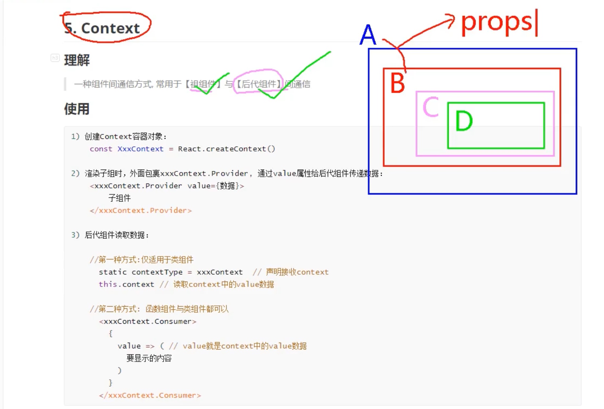
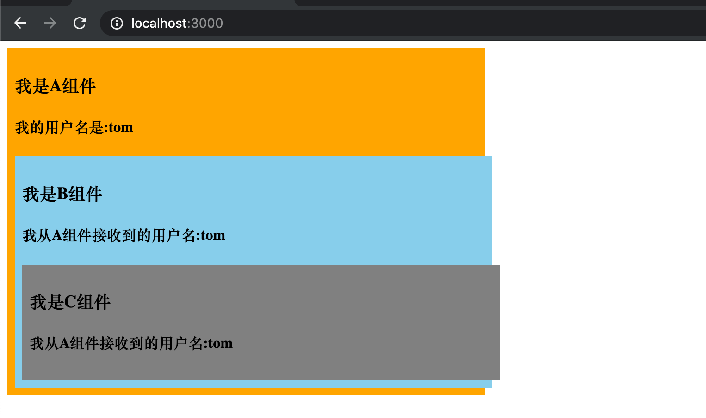
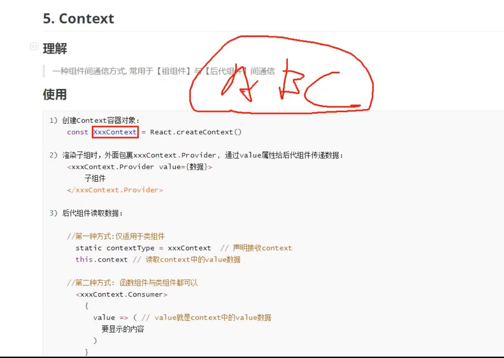
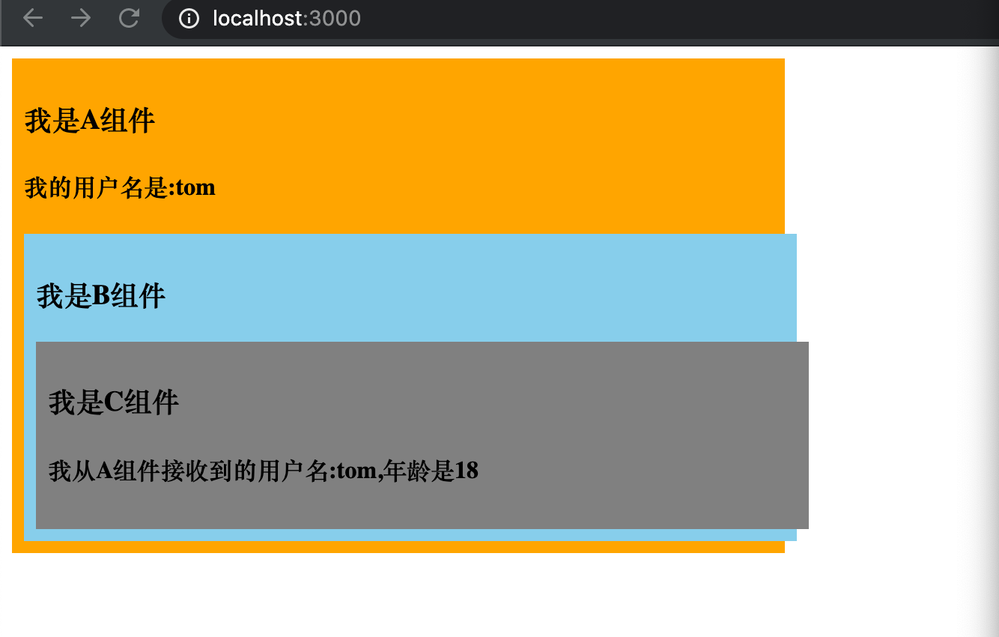

## Context



- 如果 A 和 B, 之间用更简单的props 来传值，但是 A 跟 D, 就需要用到 context 来传值


```js
import React, { Component } from 'react'
import './index.css'
export default class A extends Component {

	state = {username:'tom'}

	render() {
		return (
			<div className="parent">
				<h3>我是A组件</h3>
				<h4>我的用户名是:{this.state.username}</h4>
				<B username={this.state.username}/>
			</div>
		)
	}
}

class B extends Component {
	render() {
		return (
			<div className="child">
				<h3>我是B组件</h3>
				<h4>我从A组件接收到的用户名:{this.props.username}</h4>
				<C username={this.props.username}/>
			</div>
		)
	}
}

class C extends Component {
	render() {
		// const {username,age} = this.context
		return (
			<div className="grand">
				<h3>我是C组件</h3>
				<h4>我从A组件接收到的用户名:{this.props.username}</h4>
			</div>
		)
	}
} 
```




- 可以看到如果我们有7层组件，就不能用以上这种方式传值了。就是逐层传递.

---



- 注意 `const xxxContext = React.createContext()` 得必须在公共地方声明，

- 现在用 context 传值:


```js
import React, { Component } from 'react'
import './index.css'

//创建Context对象
const MyContext = React.createContext()
const {Provider,Consumer} = MyContext
export default class A extends Component {

	state = {username:'tom',age:18}

	render() {
		const {username,age} = this.state
		return (
			<div className="parent">
				<h3>我是A组件</h3>
				<h4>我的用户名是:{username}</h4>
				<Provider value={{username,age}}>
					<B/>
				</Provider>
			</div>
		)
	}
}

class B extends Component {
	render() {
		return (
			<div className="child">
				<h3>我是B组件</h3>
				<C/>
			</div>
		)
	}
}

class C extends Component {
	//声明接收context
	static contextType = MyContext
	render() {
		const {username,age} = this.context
		return (
			<div className="grand">
				<h3>我是C组件</h3>
				<h4>我从A组件接收到的用户名:{username},年龄是{age}</h4>
			</div>
		)
	}
} 
```




- 如果c 是一个函数组件呢？


```js
function C(){
	return (
		<div className="grand">
			<h3>我是C组件</h3>
			<h4>我从A组件接收到的用户名:
			<Consumer>
				{value => `${value.username},年龄是${value.age}`}
			</Consumer>
			</h4>
		</div>
	)
}
```

---

## 总结:


### 理解

> 一种组件间通信方式, 常用于【祖组件】与【后代组件】间通信

### 使用

```js
1) 创建Context容器对象：
	const XxxContext = React.createContext()  
	
2) 渲染子组时，外面包裹xxxContext.Provider, 通过value属性给后代组件传递数据：
	<xxxContext.Provider value={数据}>
		子组件
    </xxxContext.Provider>
    
3) 后代组件读取数据：

	//第一种方式:仅适用于类组件 
	  static contextType = xxxContext  // 声明接收context
	  this.context // 读取context中的value数据
	  
	//第二种方式: 函数组件与类组件都可以
	  <xxxContext.Consumer>
	    {
	      value => ( // value就是context中的value数据
	        要显示的内容
	      )
	    }
	  </xxxContext.Consumer>
```

### 注意

	在应用开发中一般不用context, 一般都它的封装react插件


