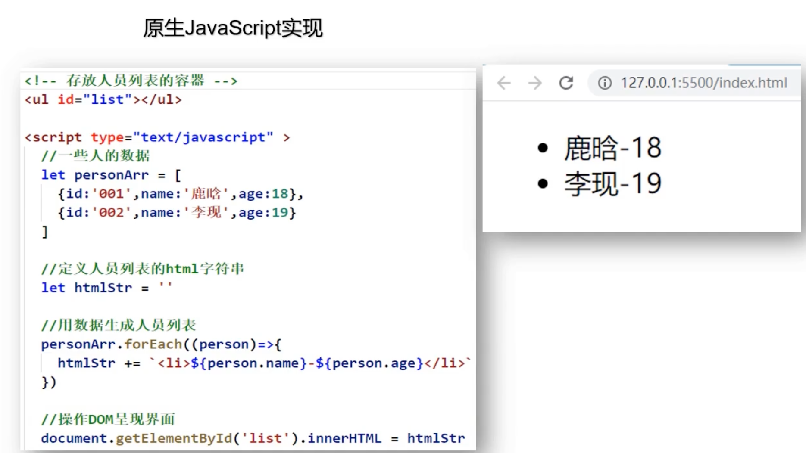
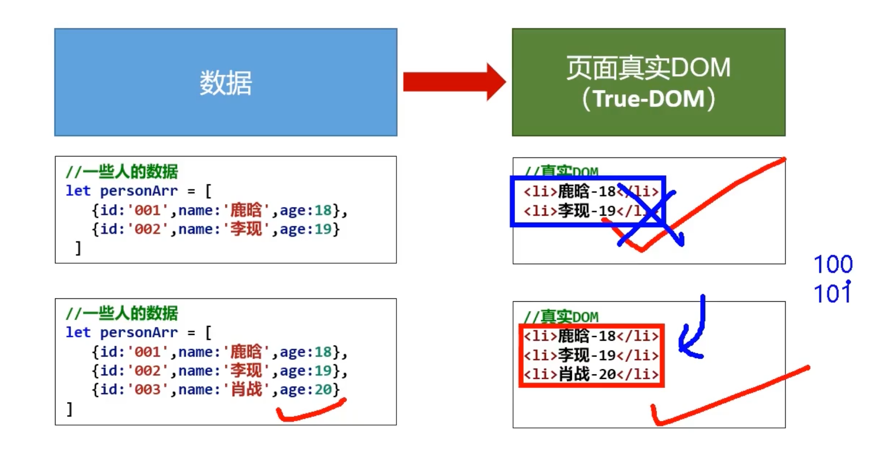
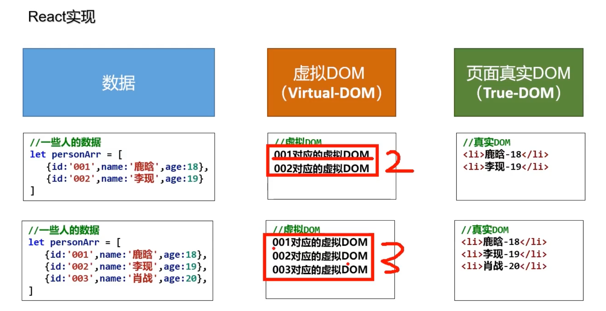
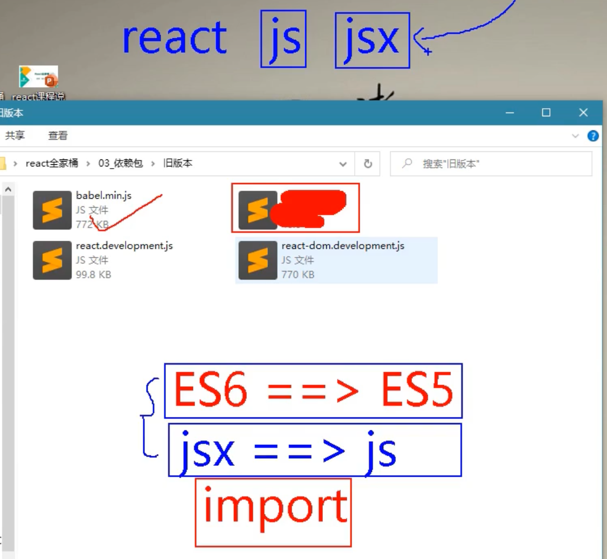

## React 原理

1. 为什么我们需要用React?

- 来看这张图，每一次浏览器都重新渲染数据，可以看到前面的数据每一次都被抛弃。
  - 前面就算有100个数据，也被丢弃，然后重新渲染，这样效率低下。

---

## 来看 react

- virtual Dom, 并不会丢弃之前的数据，而是存储在memory。

- React高效的原因
  - 使用虚拟(virtual)DOM, 不总是直接操作页面真实DOM。
  - DOM Diffing算法, 最小化页面重绘。

---

### 所需js 文件

