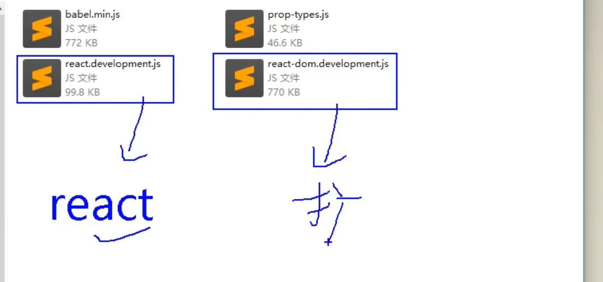
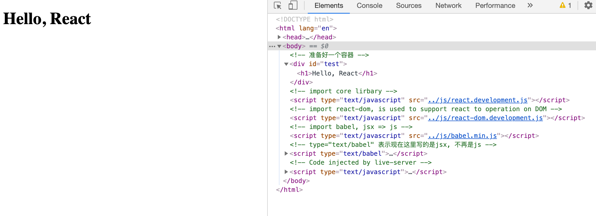

## React 原理

1. 为什么我们需要用React?


- 来看这张图，每一次浏览器都重新渲染数据，可以看到前面的数据每一次都被抛弃。
  - 前面就算有100个数据，也被丢弃，然后重新渲染，这样效率低下。

---

## 来看 react


- virtual Dom, 并不会丢弃之前的数据，而是存储在memory。

- React高效的原因
  - 使用虚拟(virtual)DOM, 不总是直接操作页面真实DOM。
  - DOM Diffing算法, 最小化页面重绘。

---

### 所需js 文件


1. 我们知道 ES6 => ES5 需要 `babel`
2. import 另外一个模块的话，需要 `babel`
3. JSX => JS，需要 `babel`




- 左边是react 核心库， 右边是扩展库（用来帮助操纵DOM）

---

### first project 旧版本

- create first project `hello`, create a folder `js`, 把旧版本三个文件放入文件夹
- create folder `01_hello`, create a hello.html

- 同时，记得在html 中先引入核心库，再引入扩展库。

---

- hello.html

```html
<!DOCTYPE html>
<html lang="en">
<head>
    <meta charset="UTF-8">
    <meta name="viewport" content="width=device-width, initial-scale=1.0">
    <title>Document</title>
</head>
<body>
    <!-- 准备好一个容器 -->
    <div id="test"></div>

    <!-- import core lirbary -->
    <script type="text/javascript" src="../js/react.development.js"></script>

    <!-- import react-dom, is used to support react to operation on DOM -->
    <script type="text/javascript" src="../js/react-dom.development.js"></script>

    <!-- import babel, jsx => js -->
    <script type="text/javascript" src="../js/babel.min.js"></script>

    <!-- type="text/babel" 表示现在这里写的是jsx, 不再是js -->
    <script type="text/babel">
        //1. create virtual DOM
        const VDOM = <h1>Hello, React</h1> //不要引号，因为不是string

        //2. render virtual DOM to web page
        // ReactDOM.render(virtual DOM, Container)
        ReactDOM.render(VDOM, document.getElementById('test'))
    </script>
    
</body>
</html>
```

