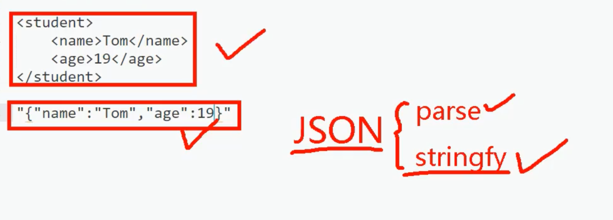
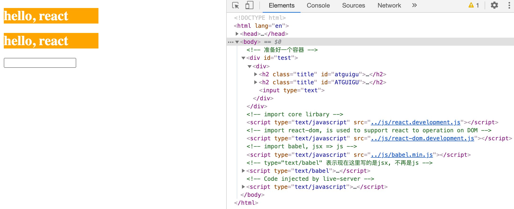
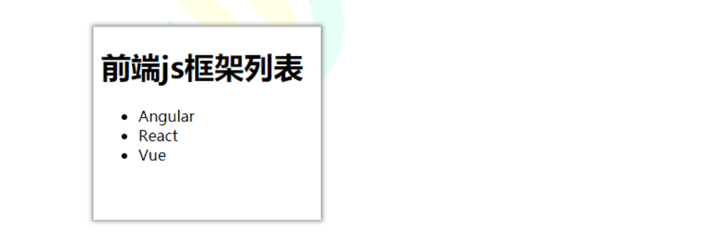
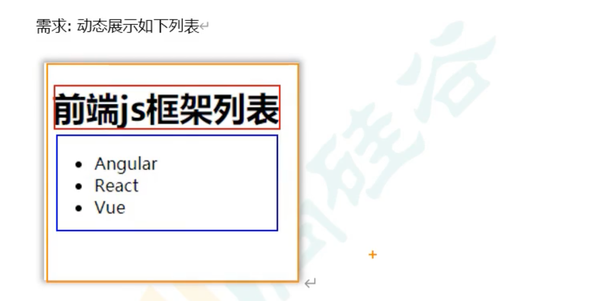
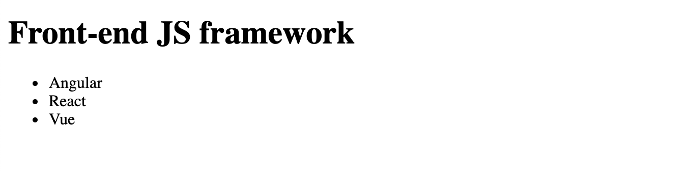
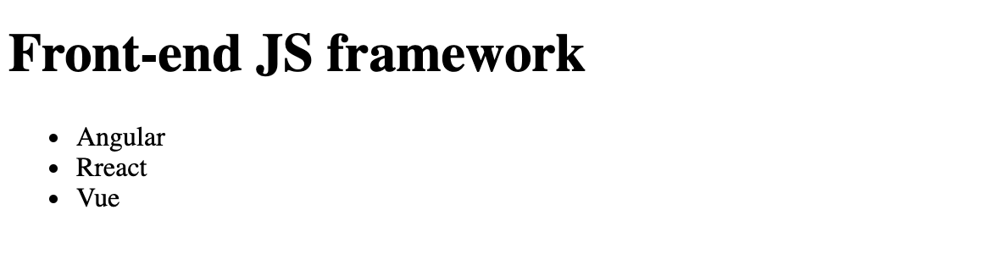
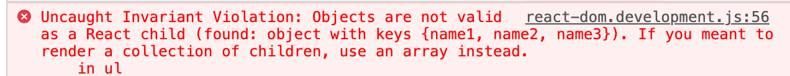
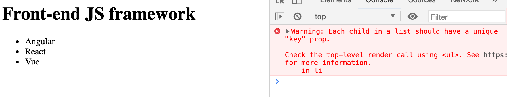
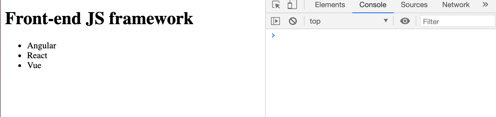

## jsx 语法规则

1.	全称:  JavaScript XML
2.	react定义的一种类似于XML的JS扩展语法: JS + XML本质是React.createElement(component, props, ...children)方法的语法糖
3.	作用: 用来简化创建虚拟DOM 
  - 1)	写法：var ele = <h1>Hello JSX!</h1>
  - 2)	注意1：它不是字符串, 也不是HTML/XML标签
  - 3)	注意2：它最终产生的就是一个JS对象
4.	标签名任意: HTML标签或其它标签
5.	标签属性任意: HTML标签属性或其它
6.	基本语法规则
  - 1)	遇到 <开头的代码, 以标签的语法解析: html同名标签转换为html同名元素, 其它标签需要特别解析
  - 2)	遇到以 { 开头的代码，以JS语法解析: 标签中的js表达式必须用{ }包含
7.	babel.js的作用
  - 1)	浏览器不能直接解析JSX代码, 需要babel转译为纯JS的代码才能运行
  - 2)	只要用了JSX，都要加上type="text/babel", 声明需要babel来处理

---

- XML 早期用于存储和传输数据



- 但也不是说现在不用xml, 比如微信公众号服务器和开发者服务器之间的打交道就用xml

---

## jsx 接收数据的方式，解释在comment

```html
<!DOCTYPE html>
<html lang="en">
<head>
    <meta charset="UTF-8">
    <meta name="viewport" content="width=device-width, initial-scale=1.0">
    <title>jsx语法规则</title>
    <style>
        .title{
            background-color: orange;
            width: 200px;
        }
    </style>
</head>
<body>
    <!-- 准备好一个容器 -->
    <div id="test"></div>

    <!-- import core lirbary -->
    <script type="text/javascript" src="../js/react.development.js"></script>

    <!-- import react-dom, is used to support react to operation on DOM -->
    <script type="text/javascript" src="../js/react-dom.development.js"></script>

    <!-- import babel, jsx => js -->
    <script type="text/javascript" src="../js/babel.min.js"></script>

    <!-- type="text/babel" 表示现在这里写的是jsx, 不再是js -->
    <script type="text/babel">
        const myId = 'aTgUiGu';
        const myData = 'HeLlo, rEaCt';
        
        
        //1. create virtual DOM
        const VDOM = (
            <div>
                <h2 className="title" id = {myId.toLowerCase()}>
                    <span style={{color:'white', fontSize:'29px'}}>
                        {myData.toLowerCase()}
                    </span>
                </h2>
                <h2 className="title" id = {myId.toUpperCase()}>
                    <span style={{color:'white', fontSize:'29px'}}>
                        {myData.toLowerCase()}
                    </span>
                </h2>
                <input type="text"/>
            </div>
        )

        //2. render virtual DOM to web page
        // ReactDOM.render(virtual DOM, Container)
        ReactDOM.render(VDOM, document.getElementById('test'))

        /*
        jsx 语法规则
        1. 定义虚拟dom时，不要写引号
        2. 标签重混入js表达式时要用{}
        3. 样式的类名指定不要用class,要用className, 特别主意，样式的传参数在jsx里其实是传进去一个object,
        所以用 {{ }},  {{color: 'white'}}, color 代表，object里的变量，'white'代表变量的value
        4. 内联样式，要用 style = {{key:value}} 的形式去写
        5. virtual DOM 必须只有一个root标签
        6. input, 标签必须闭合, 因为 在html, <input ...>, 在jsx虚拟dom， 里必须闭合
        7. 标签首字母
            1）若小写字母开头，则江该标签转为html中同名元素，若html中无该标签的同名元素，则报错。
            2）若大写字母开头，react就去渲染对应的组件，若组件没有定义，则报错
        
        */
    </script>
    
</body>
</html>
```



---

## JSX practice

- 需求: **动态**展示如下列表





- 可以分成三部分

```html
<!-- type="text/babel" 表示现在这里写的是jsx, 不再是js -->
<script type="text/babel">
    //模拟一些数据
    const data = ['Angular', 'Rreact', 'Vue']
    //1. create virtual DOM
    const VDOM = (
        <div>
            <h1>Front-end JS framework</h1>
            <ul>
                <li>Angular</li>
                <li>React</li>
                <li>Vue</li>
            </ul>
        </div>
    )

    //2. render virtual DOM to Web Page
    ReactDOM.render(VDOM, document.getElementById('test'));
</script>
```



---

```html
<script type="text/babel">
    //模拟一些数据
    const data = ['Angular', 'Rreact', 'Vue']
    const data2 = [<li>Angular</li>, <li>Rreact</li>, <li>Vue</li>]
    //1. create virtual DOM
    const VDOM = (
        <div>
            <h1>Front-end JS framework</h1>
            <ul>
                {data2}
            </ul>
        </div>
    )

    //2. render virtual DOM to Web Page
    ReactDOM.render(VDOM, document.getElementById('test'));
</script>
```



- 但是这样写也不好！不过从这里我们可以看到react会自动帮我们遍历数组。

### 假如给react 一个obj 会如何？

```html
<script type="text/babel">
    //模拟一些数据
    const data = ['Angular', 'React', 'Vue']
    const data2 = [<li>Angular</li>, <li>Rreact</li>, <li>Vue</li>]
    const obj = {name1: 'Angular', name2: 'React', name3: 'Vue'};
    //1. create virtual DOM
    const VDOM = (
        <div>
            <h1>Front-end JS framework</h1>
            <ul>
                {obj}
            </ul>
        </div>
    )

    //2. render virtual DOM to Web Page
    ReactDOM.render(VDOM, document.getElementById('test'));
</script>
```    



- 所以我们必须传递 array

```html
<script type="text/babel">

    //模拟一些数据
    const data = ['Angular', 'React', 'Vue']
    const data2 = [<li>Angular</li>, <li>Rreact</li>, <li>Vue</li>]
    const obj = {name1: 'Angular', name2: 'React', name3: 'Vue'};
    //1. create virtual DOM
    const VDOM = (
        <div>
            <h1>Front-end JS framework</h1>
            <ul>
                {
                    data.map((item)=>{
                        return <li>{item}</li>
                    })
                }
            </ul>
        </div>
    )

    //2. render virtual DOM to Web Page
    ReactDOM.render(VDOM, document.getElementById('test'));
</script>
```



- 可以看到每一个child必须有一个 **unique key**

- 所以可以这样改

```html
<!DOCTYPE html>
<html lang="en">
<head>
    <meta charset="UTF-8">
    <meta name="viewport" content="width=device-width, initial-scale=1.0">
    <title>Document</title>
</head>
<body>
    <!-- 准备好一个容器 -->
    <div id="test"></div>

    <!-- import core lirbary -->
    <script type="text/javascript" src="../js/react.development.js"></script>

    <!-- import react-dom, is used to support react to operation on DOM -->
    <script type="text/javascript" src="../js/react-dom.development.js"></script>

    <!-- import babel, jsx => js -->
    <script type="text/javascript" src="../js/babel.min.js"></script>

    <!-- type="text/babel" 表示现在这里写的是jsx, 不再是js -->
    <script type="text/babel">
        /*
        一定主意区分： [js语句（代码）]与【js表达式】
        1. 表达式： 一个表达式会产生一个值，可以放任何一个需要值的地方
            下面这些都是表达式：
                1） a
                2) a + b
                3) demo(1)
                4) arr.map()
                5) function test(){}
        2. 语句（代码）：
            下面这些都是语句（代码）：
                1）if(){}
                2) for(){}
                3) switch(){case:xxxx}
        */


        //模拟一些数据
        const data = ['Angular', 'React', 'Vue']
        const data2 = [<li>Angular</li>, <li>Rreact</li>, <li>Vue</li>]
        const obj = {name1: 'Angular', name2: 'React', name3: 'Vue'};
        //1. create virtual DOM
        const VDOM = (
            <div>
                <h1>Front-end JS framework</h1>
                <ul>
                    {
                        data.map((item, index)=>{
                            return <li key={index}>{item}</li>
                        })
                    }
                </ul>
            </div>
        )

        //2. render virtual DOM to Web Page
        ReactDOM.render(VDOM, document.getElementById('test'));
    </script>
    
</body>
</html>
```



- 可以看到警告解除。


