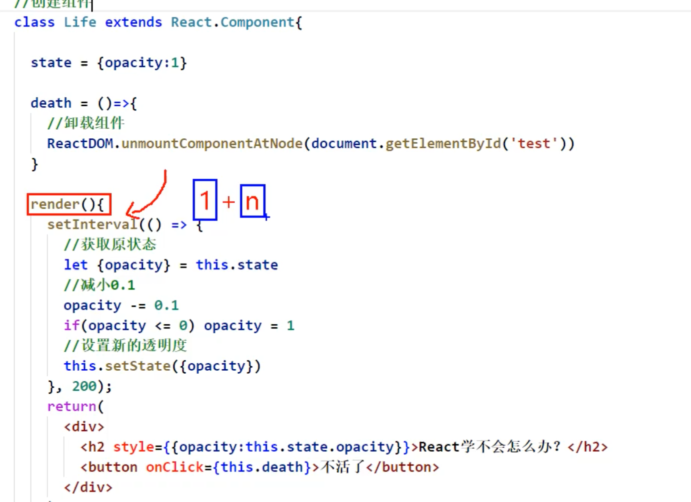

## 最重要的概念：组件的生命周期


- 先看这个demo, 渐进变化

---

## 解释


- 我们总说渲染组件到页面上，把组件挂载到页面上


```ruby
挂载  mount
卸载  unmount
```

---

```html
	<script type="text/babel">
		//创建组件
		//生命周期回调函数 <=> 生命周期钩子函数 <=> 生命周期函数 <=> 生命周期钩子
		class Life extends React.Component{

			state = {opacity:1}

			death = ()=>{
				//卸载组件
				ReactDOM.unmountComponentAtNode(document.getElementById('test'))
			}


			//初始化渲染、状态更新之后
			render(){
                setInterval(()=>{
                    //获取原状态
                    let {opactiy} = this.state
                    //减小0.1
                    opacity -= 0.1
                    if(opactiy <= 0) opacity = 1;
                    //设置新的透明度
                    this.setState({opactiy})
                }, 200);
				return(
					<div>
						<h2 style={{opacity:this.state.opacity}}>React学不会怎么办？</h2>
						<button onClick={this.death}>不活了</button>
					</div>
				)
			}
		}
		//渲染组件
		ReactDOM.render(<Life/>,document.getElementById('test'))
	</script>
```




- 注意每次都是 1 + n 调用，因为react 初始化是1次，然后改变多少次state, 就多少次 render


- 每一次更改 state, 就开启一个新的render()

---


- 如图： cpu 已经增长到 94 度！

---

```js
		//创建组件
		//生命周期回调函数 <=> 生命周期钩子函数 <=> 生命周期函数 <=> 生命周期钩子
		class Life extends React.Component{

			state = {opacity:1}

			death = ()=>{
				//卸载组件
				ReactDOM.unmountComponentAtNode(document.getElementById('test'))
			}

			action = ()=>{
                setInterval(()=>{
                    //获取原状态
                    let {opacity} = this.state
                    //减小0.1
                    opacity -= 0.1
                    if(opacity <= 0) opacity = 1
                    //设置新的透明度
                    this.setState({opacity})
                }, 200);
			}


			//初始化渲染、状态更新之后
			render(){
                console.log('render')
				return(
					<div>
						<h2 style={{opacity:this.state.opacity}}>React学不会怎么办？</h2>
						<button onClick={this.death}>不活了</button>
						<button onClick={this.action}>开始变化</button>
					</div>
				)
			}
		}
		//渲染组件
		ReactDOM.render(<Life/>,document.getElementById('test'))
```


- 这样不是我们所要的，需要点击一下button, 我们想要的是一刷新，组件就被挂载

---

### 现在我们改进

```js
		//创建组件
		//生命周期回调函数 <=> 生命周期钩子函数 <=> 生命周期函数 <=> 生命周期钩子
		class Life extends React.Component{

			state = {opacity:1}

			death = ()=>{
				//卸载组件
				ReactDOM.unmountComponentAtNode(document.getElementById('test'))
			}

			//组件挂载完毕
			componentDidMount(){
				console.log('componentDidMount');
				this.timer = setInterval(() => {
					//获取原状态
					let {opacity} = this.state
					//减小0.1
					opacity -= 0.1
					if(opacity <= 0) opacity = 1
					//设置新的透明度
					this.setState({opacity})
				}, 200);
			}

			//初始化渲染、状态更新之后
			render(){
				console.log('render');
				return(
					<div>
						<h2 style={{opacity:this.state.opacity}}>React学不会怎么办？</h2>
						<button onClick={this.death}>不活了</button>
					</div>
				)
			}
		}
		//渲染组件
		ReactDOM.render(<Life/>,document.getElementById('test'))
```


- 当我们点击`不活了`， 出现error
- 这是由于，组件已经被挂载完毕，已经被清空了，所以当点击button 时候，报错
- 提示我们添加 组件将要被卸载的时候， `conmponentWillUnmount()`


```html
<!DOCTYPE html>
<html lang="en">
<head>
	<meta charset="UTF-8">
	<title>1_引出生命周期</title>
</head>
<body>
	<!-- 准备好一个“容器” -->
	<div id="test"></div>
	
	<!-- 引入react核心库 -->
	<script type="text/javascript" src="../js/react.development.js"></script>
	<!-- 引入react-dom，用于支持react操作DOM -->
	<script type="text/javascript" src="../js/react-dom.development.js"></script>
	<!-- 引入babel，用于将jsx转为js -->
	<script type="text/javascript" src="../js/babel.min.js"></script>

	<script type="text/babel">
		//创建组件
		//生命周期回调函数 <=> 生命周期钩子函数 <=> 生命周期函数 <=> 生命周期钩子
		class Life extends React.Component{

			state = {opacity:1}

			death = ()=>{
				//卸载组件
				ReactDOM.unmountComponentAtNode(document.getElementById('test'))
			}

			//组件挂载完毕
			componentDidMount(){
				console.log('componentDidMount');
				this.timer = setInterval(() => {
					//获取原状态
					let {opacity} = this.state
					//减小0.1
					opacity -= 0.1
					if(opacity <= 0) opacity = 1
					//设置新的透明度
					this.setState({opacity})
				}, 200);
			}

			//组件将要卸载
			componentWillUnmount(){
				//清除定时器
				clearInterval(this.timer)
			}

			//初始化渲染、状态更新之后
			render(){
				console.log('render');
				return(
					<div>
						<h2 style={{opacity:this.state.opacity}}>React学不会怎么办？</h2>
						<button onClick={this.death}>不活了</button>
					</div>
				)
			}
		}
		//渲染组件
		ReactDOM.render(<Life/>,document.getElementById('test'))
	</script>
</body>
</html>
```


- React承诺，当渲染完组件，它会帮你调用 `componentDidMount()` and `componentWillUnmount()`


