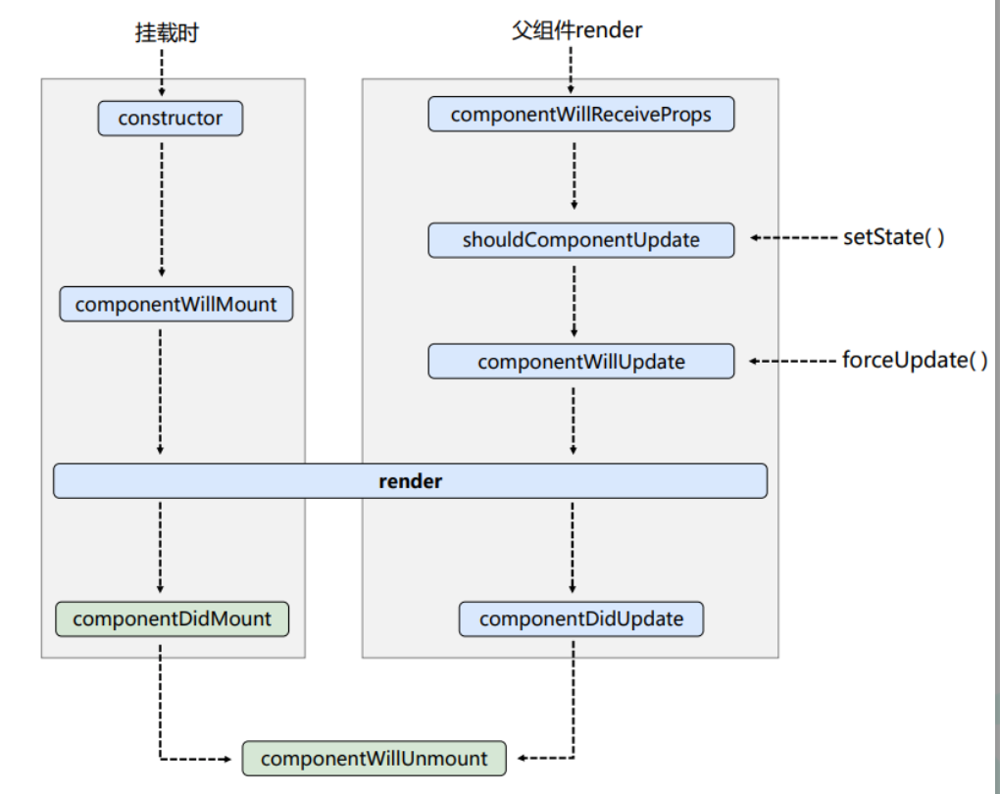
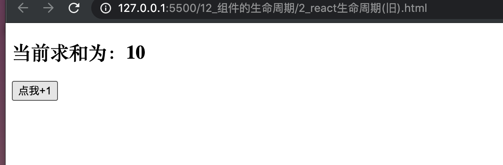
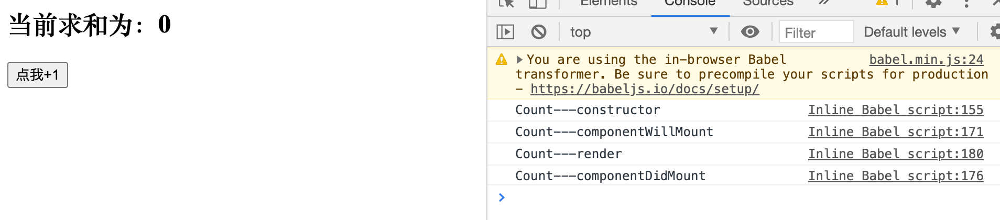
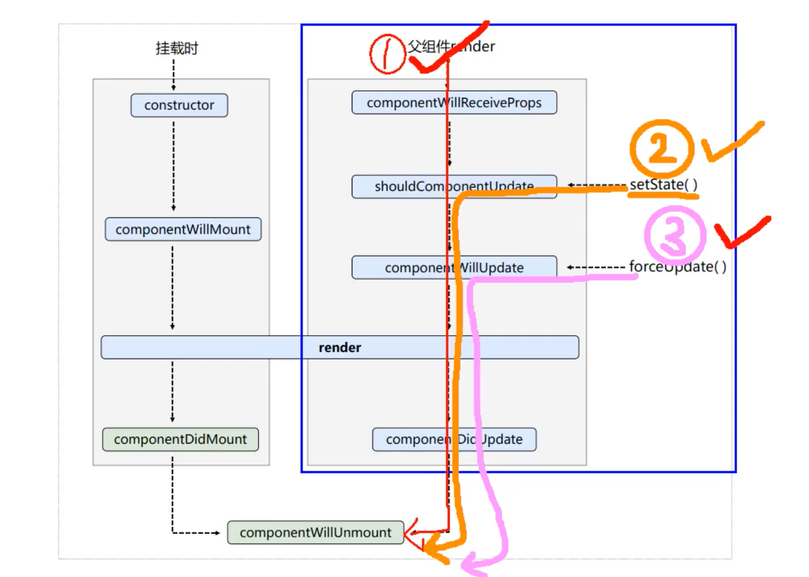
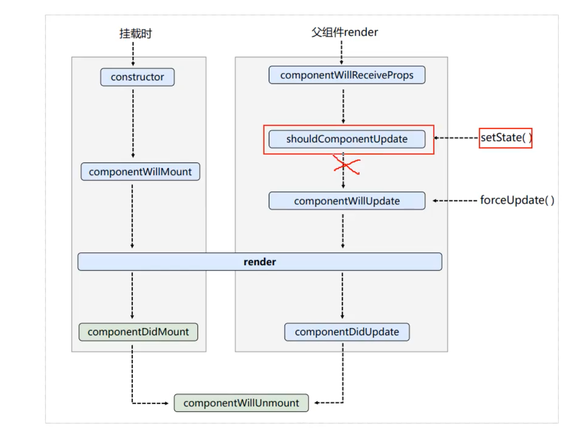

## 生命周期(旧)， 组件挂载流程



- 按照旧的流程图来写一个案例:


```js
				//创建组件
		class Count extends React.Component{


			state = {count:0}

			//加1按钮的回调
			add = ()=>{
				//获取原状态
				const {count} = this.state
				//更新状态
				this.setState({count:count+1})
			}


			render(){
				console.log('Count---render');
				const {count} = this.state
				return(
					<div>
						<h2>当前求和为：{count}</h2>
						<button onClick={this.add}>点我+1</button>
					</div>
				)
			}
		}
		
		//渲染组件
		ReactDOM.render(<Count/>,document.getElementById('test'))
```




---

## 现在开始测试一一生命周期函数


```js
		//创建组件
		class Count extends React.Component{

			//构造器
			constructor(props){
				console.log('Count---constructor');
				super(props)
				//初始化状态
				this.state = {count:0}
			}

			//加1按钮的回调
			add = ()=>{
				//获取原状态
				const {count} = this.state
				//更新状态
				this.setState({count:count+1})
			}

			//组件将要挂载的钩子
			componentWillMount(){
				console.log('Count---componentWillMount');
			}			

			//组件挂载完毕的钩子
			componentDidMount(){
				console.log('Count---componentDidMount');
			}

			render(){
				console.log('Count---render');
				const {count} = this.state
				return(
					<div>
						<h2>当前求和为：{count}</h2>
						<button onClick={this.add}>点我+1</button>
					</div>
				)
			}
		}
		
		//渲染组件
		ReactDOM.render(<Count/>,document.getElementById('test'))
```





---

## shouldComponentUpdate() && setState()





- 这三个流程，我们先来测试第二个流程，当calling `setState()`, `shouldComponentUpdate()` 会返回 true or false
  - 如果true, 则继续往下流程。
  - 所以 `shouldComponentUpdate()` 就像是一个阀门.
  - 如果在我们的代码中，不写 `shouldComponentUpdate()`, 它有一个默认的返回值 => true, 
  - 如果overwrite `shouldComponentUpdate()`, 返回false, 那么所有状态不会继续进行更行，也不会call `render()`
  - 如果overwrite `shouldComponentUpdate()`, 不写返回值, 那么retruan undefined
  

```js
		//创建组件
		class Count extends React.Component{

			//构造器
			constructor(props){
				console.log('Count---constructor');
				super(props)
				//初始化状态
				this.state = {count:0}
			}

			//加1按钮的回调
			add = ()=>{
				//获取原状态
				const {count} = this.state
				//更新状态
				this.setState({count:count+1})
			}

			//卸载组件按钮的回调
			death = ()=>{
				ReactDOM.unmountComponentAtNode(document.getElementById('test'))
			}			

			//组件将要挂载的钩子
			componentWillMount(){
				console.log('Count---componentWillMount');
			}			

			//组件挂载完毕的钩子
			componentDidMount(){
				console.log('Count---componentDidMount');
			}

			//组件将要卸载的钩子
			componentWillUnmount(){
				console.log('Count---componentWillUnmount');
			}			

			//控制组件更新的“阀门”
			shouldComponentUpdate(){
				console.log('Count---shouldComponentUpdate');
				// return true
			}			

			render(){
				console.log('Count---render');
				const {count} = this.state
				return(
					<div>
						<h2>当前求和为：{count}</h2>
						<button onClick={this.add}>点我+1</button>
				        <button onClick={this.death}>卸载组件</button>
					</div>
				)
			}
		}
		
		//渲染组件
		ReactDOM.render(<Count/>,document.getElementById('test'))
```


