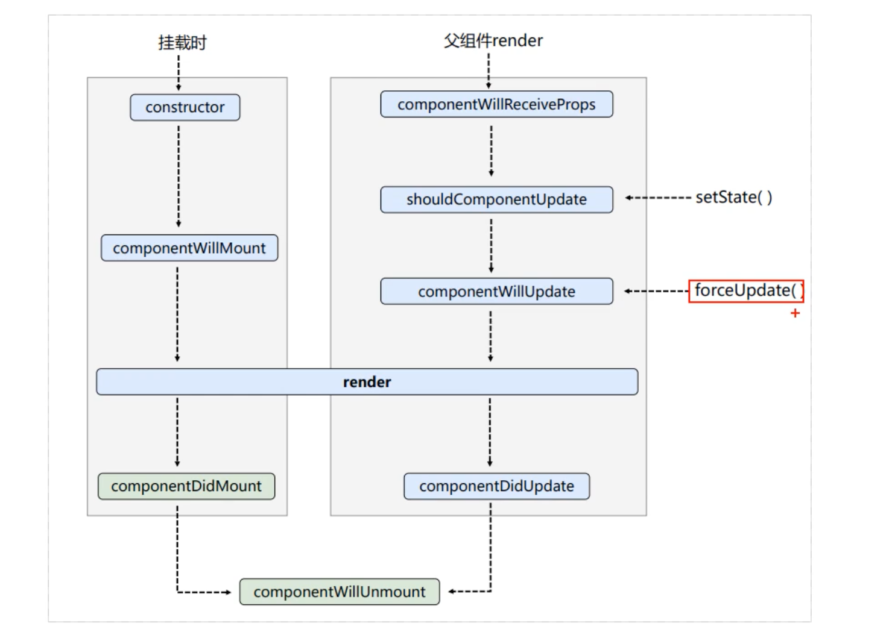
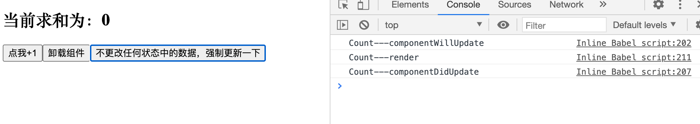
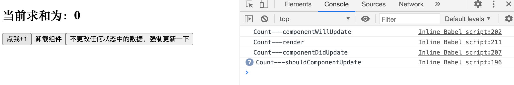

## 生命周期(旧)， forceUpdate()



- 强制更新 `forceUpdate()`, 如果触发它，就会无视`shouldComponentUpdate()` 阀门。


```js
//创建组件
class Count extends React.Component{

	//构造器
	constructor(props){
		console.log('Count---constructor');
		super(props)
		//初始化状态
		this.state = {count:0}
	}

	//加1按钮的回调
	add = ()=>{
		//获取原状态
		const {count} = this.state
		//更新状态
		this.setState({count:count+1})
	}

	//卸载组件按钮的回调
	death = ()=>{
		ReactDOM.unmountComponentAtNode(document.getElementById('test'))
	}			

	//强制更新按钮的回调
	force = ()=>{
		this.forceUpdate()
	}			

	//组件将要挂载的钩子
	componentWillMount(){
		console.log('Count---componentWillMount');
	}			

	//组件挂载完毕的钩子
	componentDidMount(){
		console.log('Count---componentDidMount');
	}

	//组件将要卸载的钩子
	componentWillUnmount(){
		console.log('Count---componentWillUnmount');
	}			

	//控制组件更新的“阀门”
	shouldComponentUpdate(){
		console.log('Count---shouldComponentUpdate');
		return true
	}

	//组件将要更新的钩子
	componentWillUpdate(){
		console.log('Count---componentWillUpdate');
	}			
	
	//组件更新完毕的钩子
	componentDidUpdate(){
		console.log('Count---componentDidUpdate');
	}			

	render(){
		console.log('Count---render');
		const {count} = this.state
		return(
			<div>
				<h2>当前求和为：{count}</h2>
				<button onClick={this.add}>点我+1</button>
				<button onClick={this.death}>卸载组件</button>
				<button onClick={this.force}>不更改任何状态中的数据，强制更新一下</button>						
			</div>
		)
	}
}

//渲染组件
ReactDOM.render(<Count/>,document.getElementById('test'))
```



---

## 现在来尝试关闭阀门 shouldComponentUpdate()

```js
//创建组件
class Count extends React.Component{

	//构造器
	constructor(props){
		console.log('Count---constructor');
		super(props)
		//初始化状态
		this.state = {count:0}
	}

	//加1按钮的回调
	add = ()=>{
		//获取原状态
		const {count} = this.state
		//更新状态
		this.setState({count:count+1})
	}

	//卸载组件按钮的回调
	death = ()=>{
		ReactDOM.unmountComponentAtNode(document.getElementById('test'))
	}			

	//强制更新按钮的回调
	force = ()=>{
		this.forceUpdate()
	}			

	//组件将要挂载的钩子
	componentWillMount(){
		console.log('Count---componentWillMount');
	}			

	//组件挂载完毕的钩子
	componentDidMount(){
		console.log('Count---componentDidMount');
	}

	//组件将要卸载的钩子
	componentWillUnmount(){
		console.log('Count---componentWillUnmount');
	}			

	//控制组件更新的“阀门”
	shouldComponentUpdate(){
		console.log('Count---shouldComponentUpdate');
		return false
	}

	//组件将要更新的钩子
	componentWillUpdate(){
		console.log('Count---componentWillUpdate');
	}			
	
	//组件更新完毕的钩子
	componentDidUpdate(){
		console.log('Count---componentDidUpdate');
	}			

	render(){
		console.log('Count---render');
		const {count} = this.state
		return(
			<div>
				<h2>当前求和为：{count}</h2>
				<button onClick={this.add}>点我+1</button>
				<button onClick={this.death}>卸载组件</button>
				<button onClick={this.force}>不更改任何状态中的数据，强制更新一下</button>						
			</div>
		)
	}
}
```


- 如图所示，就算关闭阀门，依然强制执行!
- 但是关闭了阀门，虽然强制执行，但是也无法更改状态 state:




