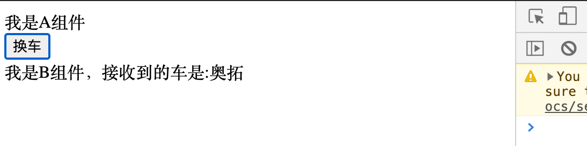
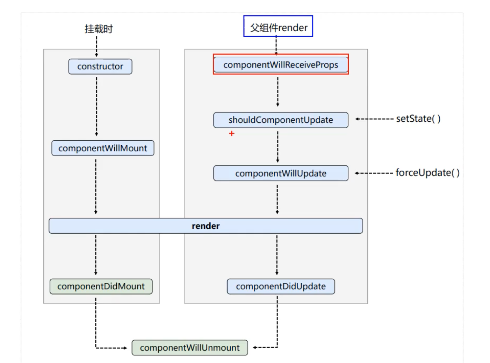
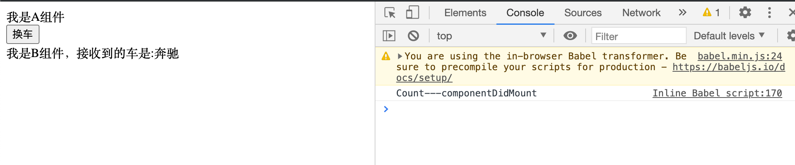
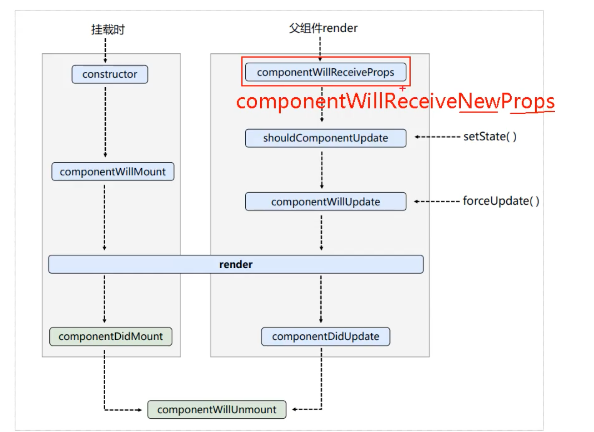
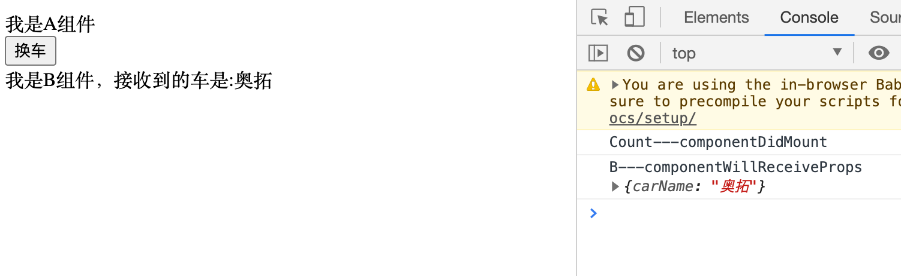
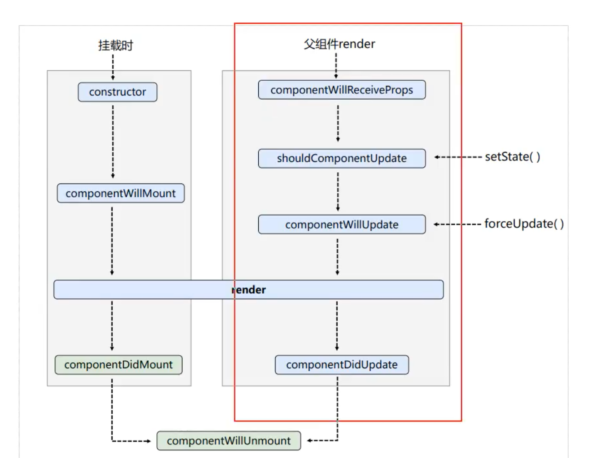
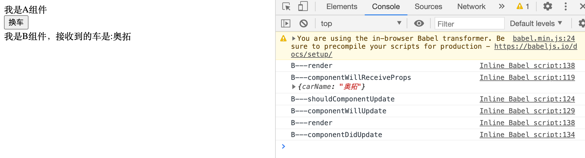

## 生命周期(旧)， 父组件render

```html
<!DOCTYPE html>
<html lang="en">
<head>
	<meta charset="UTF-8">
	<title>2_react生命周期(旧)</title>
</head>
<body>
	<!-- 准备好一个“容器” -->
	<div id="test"></div>
	
	<!-- 引入react核心库 -->
	<script type="text/javascript" src="../js/react.development.js"></script>
	<!-- 引入react-dom，用于支持react操作DOM -->
	<script type="text/javascript" src="../js/react-dom.development.js"></script>
	<!-- 引入babel，用于将jsx转为js -->
	<script type="text/javascript" src="../js/babel.min.js"></script>

	<script type="text/babel">
		
		//父组件A
		class A extends React.Component{
			//初始化状态
			state = {carName:'奔驰'}

			changeCar = ()=>{
				this.setState({carName:'奥拓'})
			}

			render(){
				return(
					<div>
						<div>我是A组件</div>
						<button onClick={this.changeCar}>换车</button>
						<B carName={this.state.carName}/>
					</div>
				)
			}
		}
		
		//子组件B
		class B extends React.Component{
			render(){
				return(
					<div>我是B组件，接收到的车是:{this.props.carName}</div>
				)
			}
		}
		
		//渲染组件
		ReactDOM.render(<A/>,document.getElementById('test'))
	</script>
</body>
</html>
```



- 在点击完button, 名字更改.

---



- 我们上面的代码，很明显A是父，B是子, 组件B将要接收props的时候开始调用 `componentWillReceiveProps(props)`

- 那我们来看看是否在接收props前，会调用`componentWillReceiveProps(props)`


```js
//父组件A
class A extends React.Component{
	//初始化状态
	state = {carName:'奔驰'}

	changeCar = ()=>{
		this.setState({carName:'奥拓'})
	}

	render(){
		return(
			<div>
				<div>我是A组件</div>
				<button onClick={this.changeCar}>换车</button>
				<B carName={this.state.carName}/>
			</div>
		)
	}
}

//子组件B
class B extends React.Component{
	//组件挂载完毕的钩子
	componentDidMount(){
		console.log('Count---componentDidMount');
	}			            
	componentWillReceiveProps(props){
		console.log('B---componentWillReceiveProps',props);
	}			
	render(){
		return(
			<div>我是B组件，接收到的车是:{this.props.carName}</div>
		)
	}
}
```




- 可以看到 `componentDidMount()`, 已经执行了，却没有执行 `componentWillReceiveProps(props)`
  - 这是因为，第一次不会执行`componentWillReceiveProps(props)`, 要在第二次才会执行... 😓 

- 我们可以看到已经接收了数据 `奔驰`， 说明 `<div>我是B组件，接收到的车是:{this.props.carName}</div>`, B组件确实已经接收props




- 所以当我们点击之后，第二次就执行`componentWillReceiveProps(props)`



- 而且我们看到 `componentWillReceiveProps(props)`, 还能接收到 props

---

## 现在我们只看生命周期函数的右半部分，执行流程：




```js
//父组件A
class A extends React.Component{
	//初始化状态
	state = {carName:'奔驰'}

	changeCar = ()=>{
		this.setState({carName:'奥拓'})
	}

	render(){
		return(
			<div>
				<div>我是A组件</div>
				<button onClick={this.changeCar}>换车</button>
				<B carName={this.state.carName}/>
			</div>
		)
	}
}

//子组件B
class B extends React.Component{
	//组件将要接收新的props的钩子
	componentWillReceiveProps(props){
		console.log('B---componentWillReceiveProps',props);
	}

	//控制组件更新的“阀门”
	shouldComponentUpdate(){
		console.log('B---shouldComponentUpdate');
		return true
	}
	//组件将要更新的钩子
	componentWillUpdate(){
		console.log('B---componentWillUpdate');
	}

	//组件更新完毕的钩子
	componentDidUpdate(){
		console.log('B---componentDidUpdate');
	}

	render(){
		console.log('B---render');
		return(
			<div>我是B组件，接收到的车是:{this.props.carName}</div>
		)
	}
}

//渲染组件
ReactDOM.render(<A/>,document.getElementById('test'))
```




---


## 总结


```html
<!DOCTYPE html>
<html lang="en">
<head>
	<meta charset="UTF-8">
	<title>2_react生命周期(旧)</title>
</head>
<body>
	<!-- 准备好一个“容器” -->
	<div id="test"></div>
	
	<!-- 引入react核心库 -->
	<script type="text/javascript" src="../js/react.development.js"></script>
	<!-- 引入react-dom，用于支持react操作DOM -->
	<script type="text/javascript" src="../js/react-dom.development.js"></script>
	<!-- 引入babel，用于将jsx转为js -->
	<script type="text/javascript" src="../js/babel.min.js"></script>

	<script type="text/babel">
		/* 
				1. 初始化阶段: 由ReactDOM.render()触发---初次渲染
									1.	constructor()
									2.	componentWillMount()
									3.	render()
									4.	componentDidMount() =====> 常用
													一般在这个钩子中做一些初始化的事，例如：开启定时器、发送网络请求、订阅消息
				2. 更新阶段: 由组件内部this.setSate()或父组件render触发
									1.	shouldComponentUpdate()
									2.	componentWillUpdate()
									3.	render() =====> 必须使用的一个
									4.	componentDidUpdate()
				3. 卸载组件: 由ReactDOM.unmountComponentAtNode()触发
									1.	componentWillUnmount()  =====> 常用
													一般在这个钩子中做一些收尾的事，例如：关闭定时器、取消订阅消息
		*/
		//创建组件
		class Count extends React.Component{

			//构造器
			constructor(props){
				console.log('Count---constructor');
				super(props)
				//初始化状态
				this.state = {count:0}
			}

			//加1按钮的回调
			add = ()=>{
				//获取原状态
				const {count} = this.state
				//更新状态
				this.setState({count:count+1})
			}

			//卸载组件按钮的回调
			death = ()=>{
				ReactDOM.unmountComponentAtNode(document.getElementById('test'))
			}

			//强制更新按钮的回调
			force = ()=>{
				this.forceUpdate()
			}

			//组件将要挂载的钩子
			componentWillMount(){
				console.log('Count---componentWillMount');
			}

			//组件挂载完毕的钩子
			componentDidMount(){
				console.log('Count---componentDidMount');
			}

			//组件将要卸载的钩子
			componentWillUnmount(){
				console.log('Count---componentWillUnmount');
			}

			//控制组件更新的“阀门”
			shouldComponentUpdate(){
				console.log('Count---shouldComponentUpdate');
				return true
			}

			//组件将要更新的钩子
			componentWillUpdate(){
				console.log('Count---componentWillUpdate');
			}

			//组件更新完毕的钩子
			componentDidUpdate(){
				console.log('Count---componentDidUpdate');
			}

			render(){
				console.log('Count---render');
				const {count} = this.state
				return(
					<div>
						<h2>当前求和为：{count}</h2>
						<button onClick={this.add}>点我+1</button>
						<button onClick={this.death}>卸载组件</button>
						<button onClick={this.force}>不更改任何状态中的数据，强制更新一下</button>
					</div>
				)
			}
		}


		//父组件A
		class A extends React.Component{
			//初始化状态
			state = {carName:'奔驰'}

			changeCar = ()=>{
				this.setState({carName:'奥拓'})
			}

			render(){
				return(
					<div>
						<div>我是A组件</div>
						<button onClick={this.changeCar}>换车</button>
						<B carName={this.state.carName}/>
					</div>
				)
			}
		}
		
		//子组件B
		class B extends React.Component{
			//组件将要接收新的props的钩子
			componentWillReceiveProps(props){
				console.log('B---componentWillReceiveProps',props);
			}

			//控制组件更新的“阀门”
			shouldComponentUpdate(){
				console.log('B---shouldComponentUpdate');
				return true
			}
			//组件将要更新的钩子
			componentWillUpdate(){
				console.log('B---componentWillUpdate');
			}

			//组件更新完毕的钩子
			componentDidUpdate(){
				console.log('B---componentDidUpdate');
			}

			render(){
				console.log('B---render');
				return(
					<div>我是B组件，接收到的车是:{this.props.carName}</div>
				)
			}
		}
		
		//渲染组件
		ReactDOM.render(<A/>,document.getElementById('test'))
	</script>
</body>
</html>
```


