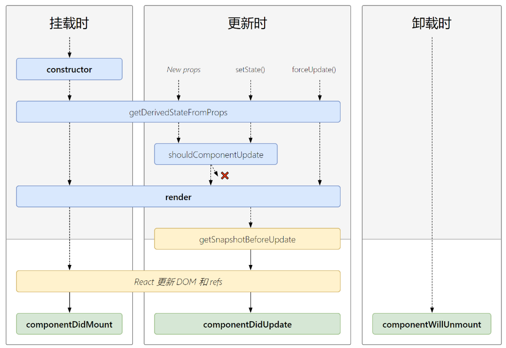
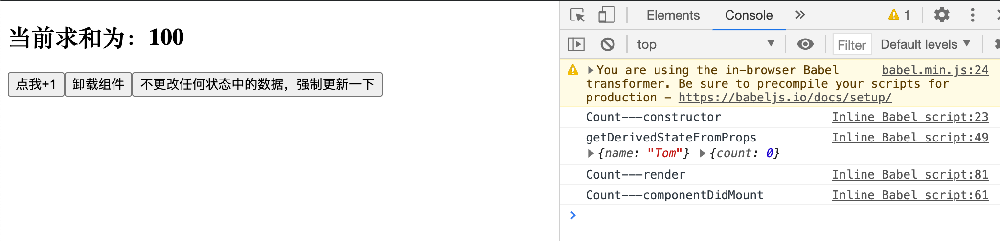
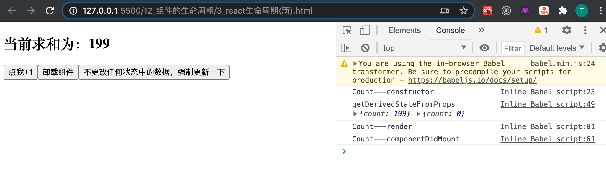
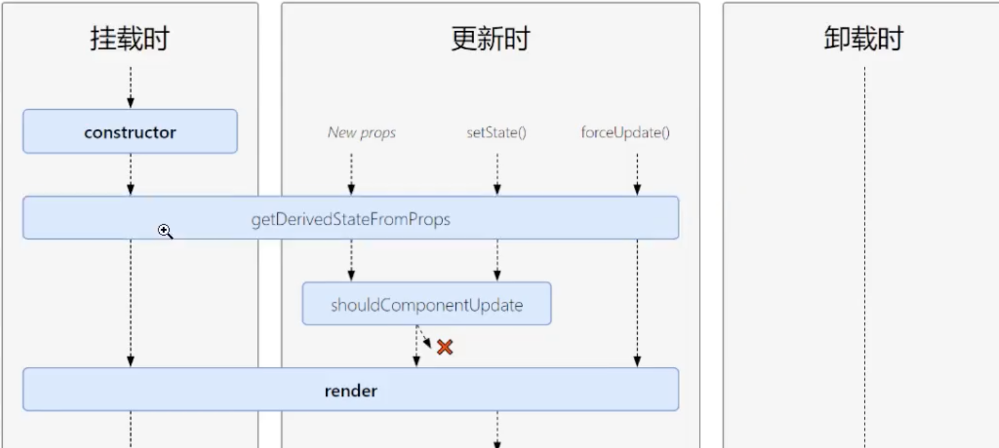
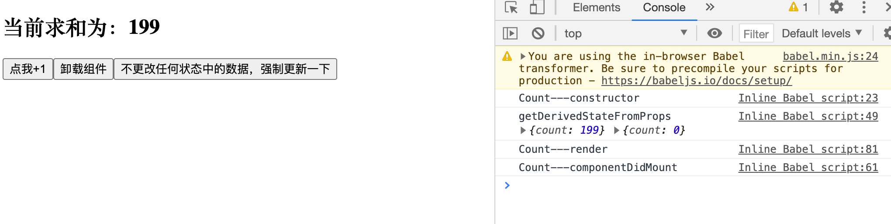

## getDerivedStateFromProps





- 几乎 `getDerivedStateFromProps` 在未来开发，我们用不到它，但是我们还是要解释一下
  - 因为它都不是一个实例的函数, 所以需要加上static 


```html
<!DOCTYPE html>
<html lang="en">
<head>
	<meta charset="UTF-8">
	<title>3_react生命周期(新)</title>
</head>
<body>
	<!-- 准备好一个“容器” -->
	<div id="test"></div>
	
	<!-- 引入react核心库 -->
	<script type="text/javascript" src="../js/17.0.1/react.development.js"></script>
	<!-- 引入react-dom，用于支持react操作DOM -->
	<script type="text/javascript" src="../js/17.0.1/react-dom.development.js"></script>
	<!-- 引入babel，用于将jsx转为js -->
	<script type="text/javascript" src="../js/17.0.1/babel.min.js"></script>

	<script type="text/babel">
		//创建组件
		class Count extends React.Component{
			constructor(props){
				console.log('Count---constructor');
				super(props)
				//初始化状态
				this.state = {count:0}
			}

			//加1按钮的回调
			add = ()=>{
				//获取原状态
				const {count} = this.state
				//更新状态
				this.setState({count:count+1})
			}

			//卸载组件按钮的回调
			death = ()=>{
				ReactDOM.unmountComponentAtNode(document.getElementById('test'))
			}

			//强制更新按钮的回调
			force = ()=>{
				this.forceUpdate()
			}
			
			//若state的值在任何时候都取决于props，那么可以使用getDerivedStateFromProps
			static getDerivedStateFromProps(props,state){
				console.log('getDerivedStateFromProps',props,state);
				return null
			}

			//在更新之前获取快照
			getSnapshotBeforeUpdate(){
				console.log('getSnapshotBeforeUpdate');
				return 'atguigu'
			}

			//组件挂载完毕的钩子
			componentDidMount(){
				console.log('Count---componentDidMount');
			}

			//组件将要卸载的钩子
			componentWillUnmount(){
				console.log('Count---componentWillUnmount');
			}

			//控制组件更新的“阀门”
			shouldComponentUpdate(){
				console.log('Count---shouldComponentUpdate');
				return true
			}

			//组件更新完毕的钩子
			componentDidUpdate(preProps,preState,snapshotValue){
				console.log('Count---componentDidUpdate',preProps,preState,snapshotValue);
			}
			
			render(){
				console.log('Count---render');
				const {count} = this.state
				return(
					<div>
						<h2>当前求和为：{count}</h2>
						<button onClick={this.add}>点我+1</button>
						<button onClick={this.death}>卸载组件</button>
						<button onClick={this.force}>不更改任何状态中的数据，强制更新一下</button>
					</div>
				)
			}
		}
		
		//渲染组件
		ReactDOM.render(<Count count={199}/>,document.getElementById('test'))
	</script>
</body>
</html>
```

---


- `getDerivedStateFromProps` 本质是返回一个 null 和 状态对象


```js
			//若state的值在任何时候都取决于props，那么可以使用getDerivedStateFromProps
			static getDerivedStateFromProps(props){
				console.log('getDerivedStateFromProps',props);
				return {count: 100}
			}
```

- 所以如果return 状态对象，那么其他功能都可以照旧，就是state 被固定.
- 同时它也可以收到 props




---

- 那如果改成 return `props`


```js
//若state的值在任何时候都取决于props，那么可以使用getDerivedStateFromProps
static getDerivedStateFromProps(props,state){
	console.log('getDerivedStateFromProps',props,state);
	return props
}

ReactDOM.render(<Count count={199}/>,document.getElementById('test'))
```



- 所以很明显，这样是把props 当作 state 来返回

---



- 由于 `getDerivedStateFromProps` 横截在那里，所以所有`setState()`, `props`, 都服从于它




