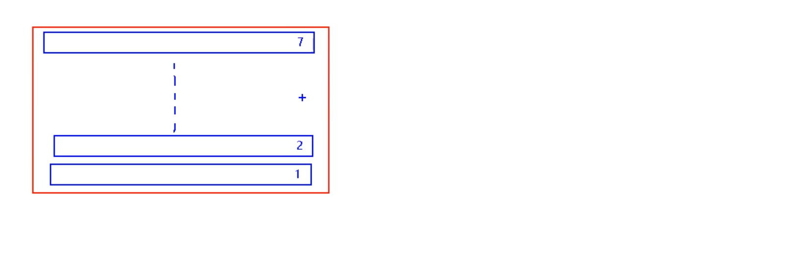
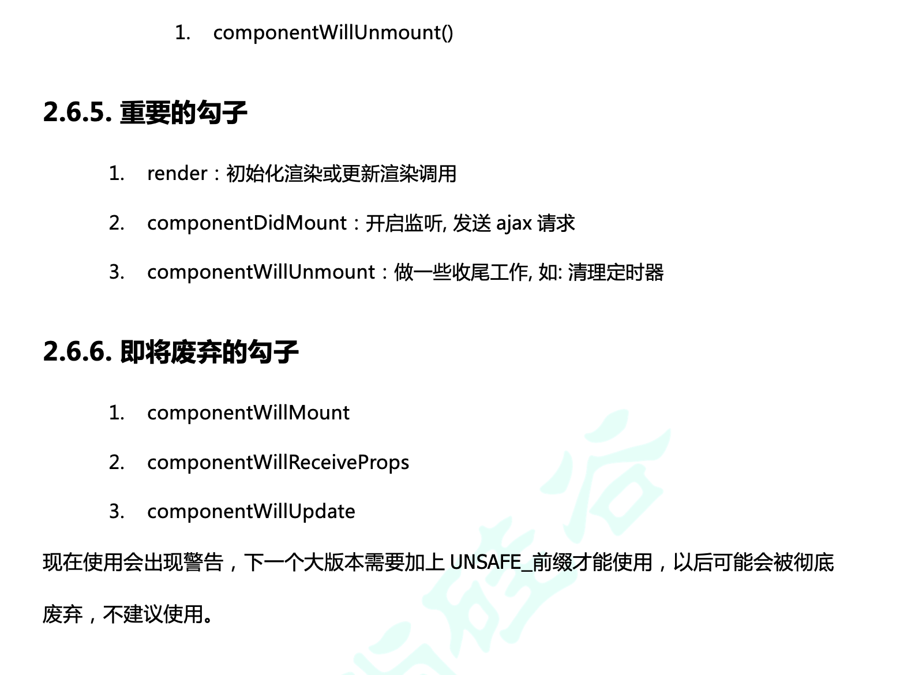

## getSnapshotBeforeUpdate News滚动的案例

- 尽管官方文档已经说了 非常少用 `getSnapshotBeforeUpdate`, 但我们还是要解释一下它的用法！



- 来写一个类似微信朋友圈列表的新闻

---

### 首先来复习一下，新闻网页结构

```html
<!DOCTYPE html>
<html lang="en">
<head>
    <meta charset="UTF-8">
    <meta name="viewport" content="width=device-width, initial-scale=1.0">
    <title>Document</title>
    <style>
        .list{
            width: 200px;
            height: 150px;
            background-color: skyblue;
        }
        .news{
            height:30px;
        }
    </style>
</head>
<body>
    <div class="list">
        <div class="news">新闻7</div>
        <div class="news">新闻6</div>
        <div class="news">新闻5</div>
        <div class="news">新闻4</div>
        <div class="news">新闻3</div>
        <div class="news">新闻2</div>
        <div class="news">新闻1</div>
    </div>
</body>
</html>
```

- 首先每条新闻是 30px, 总共150px height, 所以会有两条溢出

- 添加滚动条 `overflow:auto`


```html
<!DOCTYPE html>
<html lang="en">
<head>
    <meta charset="UTF-8" />
    <title>Document</title>
    <style>
        .list{
            width: 200px;
            height: 150px;
            background-color: skyblue;
            overflow: auto;
        }
        .news{
            height:30px;
        }
    
    </style>
</head>
<body>
    <div class="list">
        <div class="news">新闻7</div>
        <div class="news">新闻6</div>
        <div class="news">新闻5</div>
        <div class="news">新闻4</div>
        <div class="news">新闻3</div>
        <div class="news">新闻2</div>
        <div class="news">新闻1</div>
    </div>
</body>
</html>
```


- 我们不想用滚动条实现，想用js代码实现:


---

### 现在回到组件，来看react 的实现


```html
<!DOCTYPE html>
<html lang="en">
<head>
	<meta charset="UTF-8">
	<title>4_getSnapShotBeforeUpdate的使用场景</title>
	<style>
		.list{
			width: 200px;
			height: 150px;
			background-color: skyblue;
			overflow: auto;
		}
		.news{
			height: 30px;
		}
	</style>
</head>
<body>
	<!-- 准备好一个“容器” -->
	<div id="test"></div>
	
	<!-- 引入react核心库 -->
	<script type="text/javascript" src="../js/17.0.1/react.development.js"></script>
	<!-- 引入react-dom，用于支持react操作DOM -->
	<script type="text/javascript" src="../js/17.0.1/react-dom.development.js"></script>
	<!-- 引入babel，用于将jsx转为js -->
	<script type="text/javascript" src="../js/17.0.1/babel.min.js"></script>

	<script type="text/babel">
		class NewsList extends React.Component{

			state = {newsArr:[]}

			componentDidMount(){
				setInterval(() => {
					//获取原状态
					const {newsArr} = this.state
					//模拟一条新闻
					const news = '新闻'+ (newsArr.length+1)
					//更新状态
					this.setState({newsArr:[news,...newsArr]})
				}, 1000);
			}

			getSnapshotBeforeUpdate(){
				return this.refs.list.scrollHeight
			}

			componentDidUpdate(preProps,preState,height){
				this.refs.list.scrollTop += this.refs.list.scrollHeight - height
			}

			render(){
				return(
					<div className="list" ref="list">
						{
							this.state.newsArr.map((n,index)=>{
								return <div key={index} className="news">{n}</div>
							})
						}
					</div>
				)
			}
		}
		ReactDOM.render(<NewsList/>,document.getElementById('test'))
	</script>
</body>
</html>
```

- `this.refs.list.scrollTop += this.refs.list.scrollHeight - height`, 这里用 +=, 是因为持续有新闻出来，所以持续往上顶


---


## 总结：


```html
<!DOCTYPE html>
<html lang="en">
<head>
	<meta charset="UTF-8">
	<title>3_react生命周期(新)</title>
</head>
<body>
	<!-- 准备好一个“容器” -->
	<div id="test"></div>
	
	<!-- 引入react核心库 -->
	<script type="text/javascript" src="../js/17.0.1/react.development.js"></script>
	<!-- 引入react-dom，用于支持react操作DOM -->
	<script type="text/javascript" src="../js/17.0.1/react-dom.development.js"></script>
	<!-- 引入babel，用于将jsx转为js -->
	<script type="text/javascript" src="../js/17.0.1/babel.min.js"></script>

	<script type="text/babel">
		//创建组件
		class Count extends React.Component{
			/* 
				1. 初始化阶段: 由ReactDOM.render()触发---初次渲染
								1.	constructor()
								2.	getDerivedStateFromProps 
								3.	render()
								4.	componentDidMount() =====> 常用
											一般在这个钩子中做一些初始化的事，例如：开启定时器、发送网络请求、订阅消息
				2. 更新阶段: 由组件内部this.setSate()或父组件重新render触发
								1.	getDerivedStateFromProps
								2.	shouldComponentUpdate()
								3.	render()
								4.	getSnapshotBeforeUpdate
								5.	componentDidUpdate()
				3. 卸载组件: 由ReactDOM.unmountComponentAtNode()触发
								1.	componentWillUnmount()  =====> 常用
											一般在这个钩子中做一些收尾的事，例如：关闭定时器、取消订阅消息
			*/
			//构造器
			constructor(props){
				console.log('Count---constructor');
				super(props)
				//初始化状态
				this.state = {count:0}
			}

			//加1按钮的回调
			add = ()=>{
				//获取原状态
				const {count} = this.state
				//更新状态
				this.setState({count:count+1})
			}

			//卸载组件按钮的回调
			death = ()=>{
				ReactDOM.unmountComponentAtNode(document.getElementById('test'))
			}

			//强制更新按钮的回调
			force = ()=>{
				this.forceUpdate()
			}
			
			//若state的值在任何时候都取决于props，那么可以使用getDerivedStateFromProps
			static getDerivedStateFromProps(props,state){
				console.log('getDerivedStateFromProps',props,state);
				return null
			}

			//在更新之前获取快照
			getSnapshotBeforeUpdate(){
				console.log('getSnapshotBeforeUpdate');
				return 'atguigu'
			}

			//组件挂载完毕的钩子
			componentDidMount(){
				console.log('Count---componentDidMount');
			}

			//组件将要卸载的钩子
			componentWillUnmount(){
				console.log('Count---componentWillUnmount');
			}

			//控制组件更新的“阀门”
			shouldComponentUpdate(){
				console.log('Count---shouldComponentUpdate');
				return true
			}

			//组件更新完毕的钩子
			componentDidUpdate(preProps, preState, snapshotValue){
				console.log('Count---componentDidUpdate', preProps, preState, snapshotValue);
			}
			
			render(){
				console.log('Count---render');
				const {count} = this.state
				return(
					<div>
						<h2>当前求和为：{count}</h2>
						<button onClick={this.add}>点我+1</button>
						<button onClick={this.death}>卸载组件</button>
						<button onClick={this.force}>不更改任何状态中的数据，强制更新一下</button>
					</div>
				)
			}
		}
		
		//渲染组件
		ReactDOM.render(<Count count={199}/>,document.getElementById('test'))
	</script>
</body>
</html>
```

---


- 无论新旧，这三个生命周期函数，最常用，而且位置也没有变换。

---


- 左边旧版中，斜杆三个，已经不推荐使用了，新版的画圈的两个函数，只是偶尔使用!





