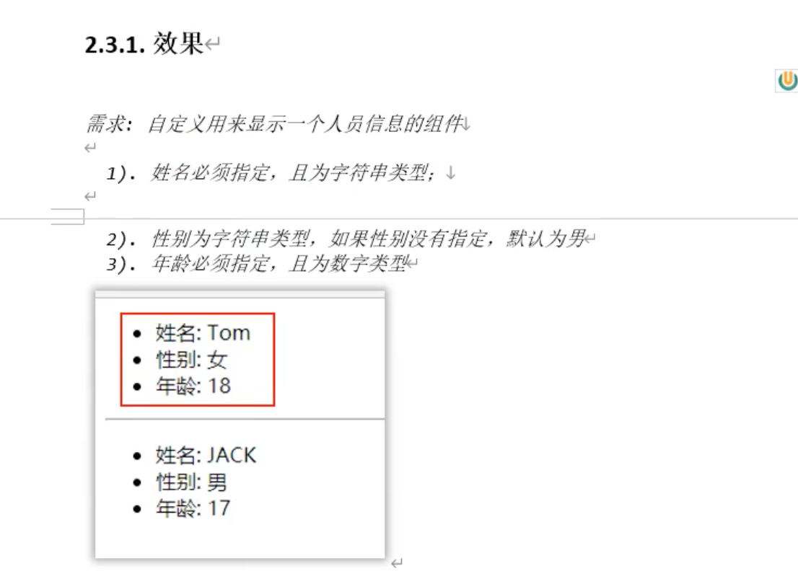
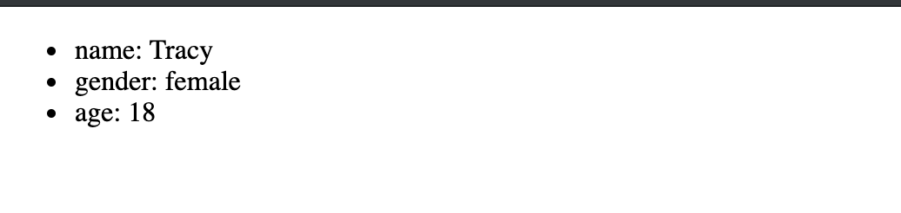
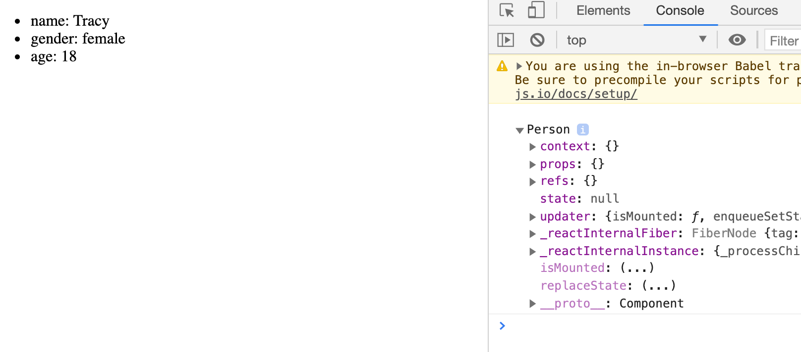
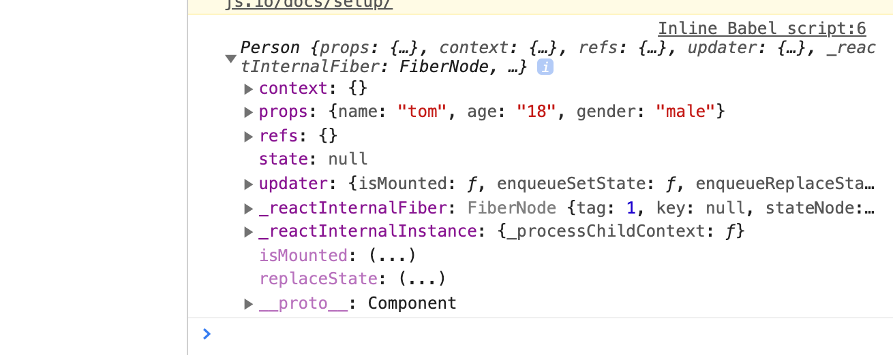
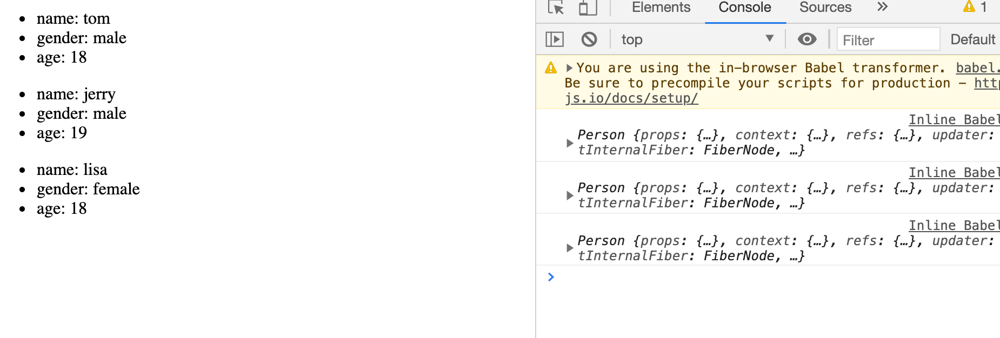
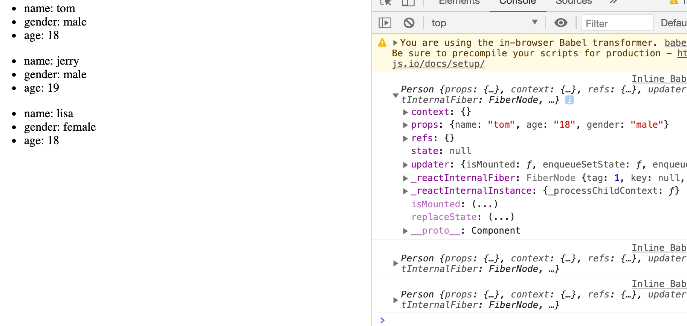

## props 的基本使用



```html
<!-- type="text/babel" 表示现在这里写的是jsx, 不再是js -->
<script type="text/babel">
    //1. create 组件
    class Person extends React.Component{
        render(){
            return(
                <ul>
                    <li>name: Tracy</li>
                    <li>gender: female</li>
                    <li>age: 18</li>                        
                </ul>
            )
        }
    }

    //2. render 组件到页面
    // ReactDOM.render(class component, Container)
    ReactDOM.render(<Person/>, document.getElementById('test'))
    </script>
```



---

- 先复习一下，render() 里的this 指向，实例

```html
<!-- type="text/babel" 表示现在这里写的是jsx, 不再是js -->
<script type="text/babel">
    //1. create 组件
    class Person extends React.Component{
        // state = {name: 'Tracy', age: 18, gender: female};
        render(){
            console.log(this)
            return(
                <ul>
                    <li>name: Tracy</li>
                    <li>gender: female</li>
                    <li>age: 18</li>                        
                </ul>
            )
        }
    }

    //2. render 组件到页面
    // ReactDOM.render(class component, Container)
    ReactDOM.render(<Person/>, document.getElementById('test1'))
</script>
```



- 可以看到 props 比 state 简单多了，因为satae需要初始化， 而props已经初始化了一个 object

---

### 首先我们来看看 props 的赋值方式：

```html
<!-- type="text/babel" 表示现在这里写的是jsx, 不再是js -->
<script type="text/babel">
    //1. create 组件
    class Person extends React.Component{
        // state = {name: 'Tracy', age: 18, gender: female};
        render(){
            console.log(this)
            return(
                <ul>
                    <li>name: Tracy</li>
                    <li>gender: female</li>
                    <li>age: 18</li>                        
                </ul>
            )
        }
    }

    //2. render 组件到页面
    // ReactDOM.render(class component, Container)
    ReactDOM.render(<Person name="tom" age="18" gender="male"/>, document.getElementById('test1'))
    </script>
```



- 可以看到已经赋值给了props

- 因此我们知道在`ReactDOM.render()` 这里传值的时候，是赋值给了props， 所以我们可以在render() 里，接受props的值：


```html
<!-- type="text/babel" 表示现在这里写的是jsx, 不再是js -->
<script type="text/babel">
    //1. create 组件
    class Person extends React.Component{
        // state = {name: 'Tracy', age: 18, gender: female};
        render(){
            console.log(this)
            return(
                <ul>
                    <li>name: {this.props.name}</li>
                    <li>gender: {this.props.gender}</li>
                    <li>age: {this.props.age}</li>                        
                </ul>
            )
        }
    }

    //2. render 组件到页面
    // ReactDOM.render(class component, Container)
    ReactDOM.render(<Person name="tom" age="18" gender="male"/>, document.getElementById('test1'))
    ReactDOM.render(<Person name="jerry" age="19" gender="male"/>, document.getElementById('test2'))
    ReactDOM.render(<Person name="lisa" age="18" gender="female"/>, document.getElementById('test3'))
</script>
```



- 可以看到外部往内部传值

---

### 可以利用结构赋值，避免写冗余的`this.props`

```html
<!-- type="text/babel" 表示现在这里写的是jsx, 不再是js -->
<script type="text/babel">
    //1. create 组件
    class Person extends React.Component{
        render(){
            console.log(this)
            const {name, age, gender} = this.props;
            return(
                <ul>
                    <li>name: {name}</li>
                    <li>gender: {gender}</li>
                    <li>age: {age}</li>                        
                </ul>
            )
        }
    }

    //2. render 组件到页面
    // ReactDOM.render(class component, Container)
    ReactDOM.render(<Person name="tom" age="18" gender="male"/>, document.getElementById('test1'))
    ReactDOM.render(<Person name="jerry" age="19" gender="male"/>, document.getElementById('test2'))
    ReactDOM.render(<Person name="lisa" age="18" gender="female"/>, document.getElementById('test3'))
</script>
```




