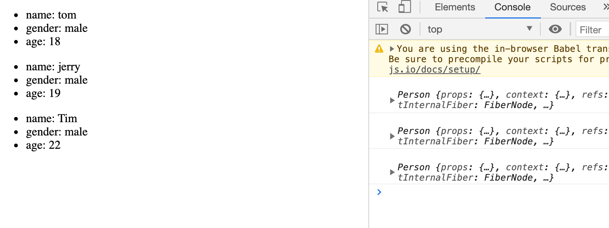
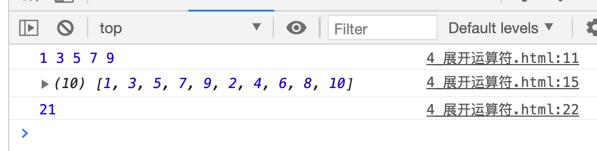

## 批量传递 props

```html

    <!-- type="text/babel" 表示现在这里写的是jsx, 不再是js -->
    <script type="text/babel">
        //1. create 组件
        class Person extends React.Component{
            render(){
                console.log(this)
                const {name, age, gender} = this.props;
                return(
                    <ul>
                        <li>name: {name}</li>
                        <li>gender: {gender}</li>
                        <li>age: {age}</li>                        
                    </ul>
                )
            }
        }

        //2. render 组件到页面
        // ReactDOM.render(class component, Container)
        ReactDOM.render(<Person name="tom" age="18" gender="male"/>, document.getElementById('test1'))
        ReactDOM.render(<Person name="jerry" age="19" gender="male"/>, document.getElementById('test2'))

        const p = {name: 'Tim', age: 22, gender: 'male'}
        ReactDOM.render(<Person name={p.name} age={p.age} gender={p.gender}/>, document.getElementById('test3'))
    </script>
```

---

- 更简单的传值办法：

```html
    <script type="text/babel">
        //1. create 组件
        class Person extends React.Component{
            render(){
                console.log(this)
                const {name, age, gender} = this.props;
                return(
                    <ul>
                        <li>name: {name}</li>
                        <li>gender: {gender}</li>
                        <li>age: {age}</li>                        
                    </ul>
                )
            }
        }

        //2. render 组件到页面
        // ReactDOM.render(class component, Container)
        ReactDOM.render(<Person name="tom" age="18" gender="male"/>, document.getElementById('test1'))
        ReactDOM.render(<Person name="jerry" age="19" gender="male"/>, document.getElementById('test2'))

        const p = {name: 'Tim', age: 22, gender: 'male'}
        // ReactDOM.render(<Person name={p.name} age={p.age} gender={p.gender}/>, document.getElementById('test3'))
        ReactDOM.render(<Person {...p}/>, document.getElementById('test3'))
    </script>
```




---

### 复习一下展开运算符：

```html
<!DOCTYPE html>
<html lang="en">
<head>
    <meta charset="UTF-8">
    <title>展开运算符</title>
</head>
<body>
    <script type="text/javascript">
        let arr1 = [1, 3, 5, 7, 9]
        let arr2 = [2, 4, 6, 8, 10]
        console.log(...arr1); //展开一个数组

        //想把 arr1 arr2 合并一起
        let arr3 = [...arr1, ...arr2];
        console.log(arr3);

        function sum(...numbers){
            return numbers.reduce((preValue, currentValue) => {
                return preValue + currentValue
            })
        }
        console.log(sum(1, 2, 3, 4, 5, 6));

			//构造字面量对象时使用展开语法
			let person = {name:'tom',age:18}
			let person2 = {...person} //克隆后的对象
			//console.log(...person); //报错，展开运算符不能展开对象
			person.name = 'jerry'
			console.log(person2);
			console.log(person);

			//合并
			let person3 = {...person,name:'jack',address:"地球"}
			console.log(person3);
    </script>
</body>
</html>
```




---


