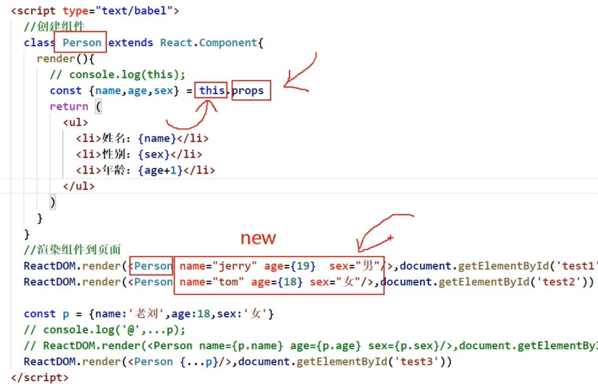
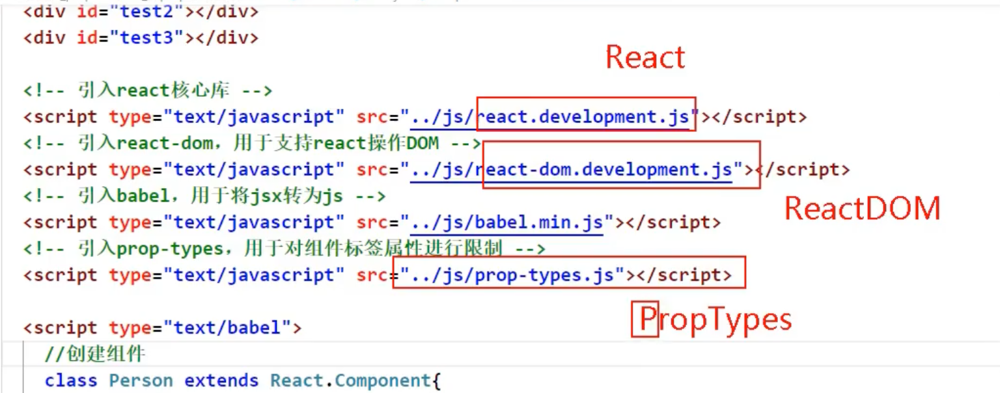

## 对 props 进行限制




- import `prop-type.js` 依赖包。




```html
<!DOCTYPE html>
<html lang="en">
<head>
	<meta charset="UTF-8">
	<title>对props进行限制</title>
</head>
<body>
	<!-- 准备好一个“容器” -->
	<div id="test1"></div>
	<div id="test2"></div>
	<div id="test3"></div>
	
	<!-- 引入react核心库 -->
	<script type="text/javascript" src="../js/react.development.js"></script>
	<!-- 引入react-dom，用于支持react操作DOM -->
	<script type="text/javascript" src="../js/react-dom.development.js"></script>
	<!-- 引入babel，用于将jsx转为js -->
	<script type="text/javascript" src="../js/babel.min.js"></script>
	<!-- 引入prop-types，用于对组件标签属性进行限制 -->
	<script type="text/javascript" src="../js/prop-types.js"></script>

	<script type="text/babel">
		//创建组件
		class Person extends React.Component{
			render(){
				// console.log(this);
				const {name,age,gender} = this.props
				//props是只读的
				//this.props.name = 'jack' //此行代码会报错，因为props是只读的
				return (
					<ul>
						<li>姓名：{name}</li>
						<li>性别：{gender}</li>
						<li>年龄：{age+1}</li>
					</ul>
				)
			}
		}
		//对标签属性进行类型、必要性的限制
		Person.propTypes = {
			name:PropTypes.string.isRequired, //限制name必传，且为字符串
			gender:PropTypes.string,//限制gender为字符串
			age:PropTypes.number,//限制age为数值
			speak:PropTypes.func,//限制speak为函数
		}
		//指定默认标签属性值
		Person.defaultProps = {
			gender:'男',//sex默认值为男
			age:18 //age默认值为18
		}
		//渲染组件到页面
		ReactDOM.render(<Person name={100} speak={speak}/>,document.getElementById('test1'))
		ReactDOM.render(<Person name="tom" age={18} gender="女"/>,document.getElementById('test2'))

		const p = {name:'老刘',age:18,gender:'女'}
		// console.log('@',...p);
		// ReactDOM.render(<Person name={p.name} age={p.age} sex={p.sex}/>,document.getElementById('test3'))
		ReactDOM.render(<Person {...p}/>,document.getElementById('test3'))

		function speak(){
			console.log('我说话了');
		}
	</script>
</body>
</html>
```

- 对Person.propType 进行限制，但是放在Person类的外面，这样其实不太好，最好的做法是把它的现在放在class 内部, 加上static 关键字。


