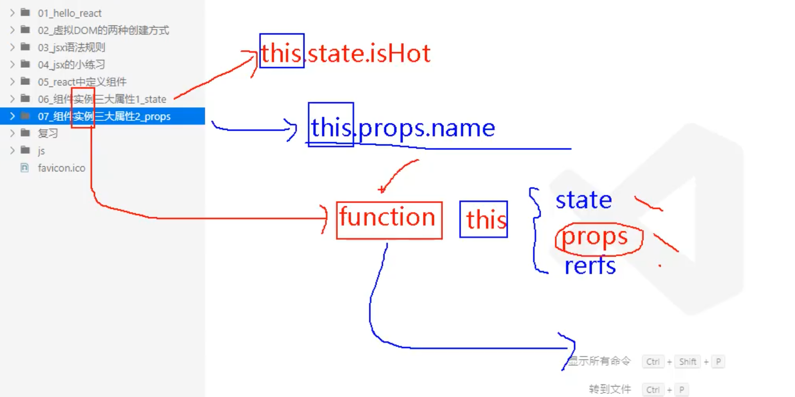
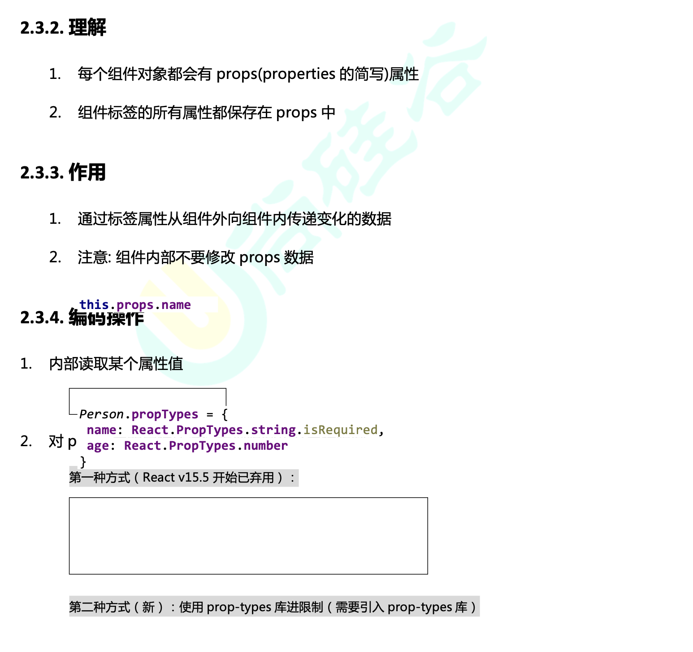

## 在之前一直强调 组件的实例三大属性！ 实例



- 函数组件是无法执行实例三大属性，也就是它没有this
  - 但是它可以执行 `props` 因为它能接收参数！

```html
<!DOCTYPE html>
<html lang="en">
<head>
	<meta charset="UTF-8">
	<title>对props进行限制</title>
</head>
<body>
	<!-- 准备好一个“容器” -->
	<div id="test1"></div>
	<div id="test2"></div>
	<div id="test3"></div>
	
	<!-- 引入react核心库 -->
	<script type="text/javascript" src="../js/react.development.js"></script>
	<!-- 引入react-dom，用于支持react操作DOM -->
	<script type="text/javascript" src="../js/react-dom.development.js"></script>
	<!-- 引入babel，用于将jsx转为js -->
	<script type="text/javascript" src="../js/babel.min.js"></script>
	<!-- 引入prop-types，用于对组件标签属性进行限制 -->
	<script type="text/javascript" src="../js/prop-types.js"></script>

	<script type="text/babel">
		//创建组件
		function Person (props){
			console.log(props)
			const {name,age,sex} = props
			return (
					<ul>
						<li>姓名：{name}</li>
						<li>性别：{sex}</li>
						<li>年龄：{age}</li>
					</ul>
				)
		}
		Person.propTypes = {
			name:PropTypes.string.isRequired, //限制name必传，且为字符串
			sex:PropTypes.string,//限制sex为字符串
			age:PropTypes.number,//限制age为数值
		}

		//指定默认标签属性值
		Person.defaultProps = {
			sex:'男',//sex默认值为男
			age:18 //age默认值为18
		}
		//渲染组件到页面
		ReactDOM.render(<Person name="jerry"/>,document.getElementById('test1'))
	</script>
</body>
</html>
```


- 函数式组件，也不能用`refs`, 它之所以可以用`props`, 是因为它本身就是一个函数
- 再说一次，函数式组件**不能**用`state`, and `refs`, 除非用最新版的`hooks`


---

## 总结




