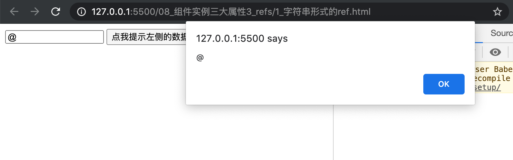
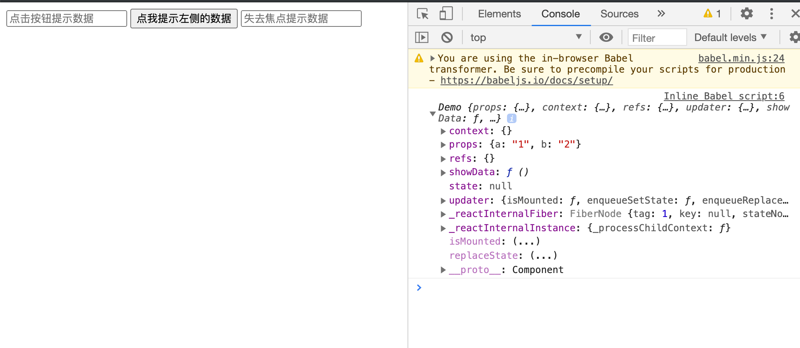
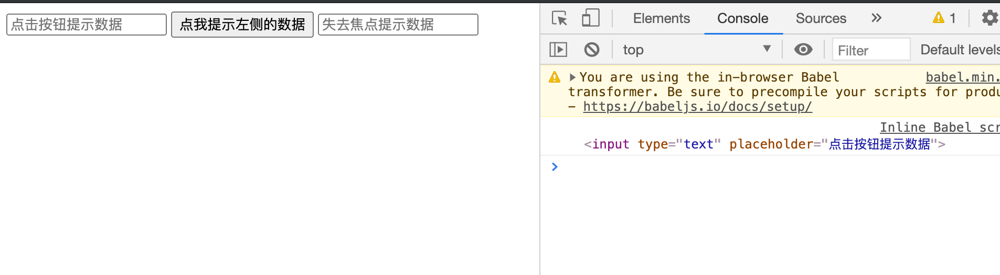

## 组件三大核心属性3:refs 与事件处理


- 首先我们看下原生js 如何写


```html
<!DOCTYPE html>
<html lang="en">
<head>
	<meta charset="UTF-8">
	<title>1_字符串形式的ref</title>
</head>
<body>
	<!-- 准备好一个“容器” -->
	<div id="test"></div>
	
	<!-- 引入react核心库 -->
	<script type="text/javascript" src="../js/react.development.js"></script>
	<!-- 引入react-dom，用于支持react操作DOM -->
	<script type="text/javascript" src="../js/react-dom.development.js"></script>
	<!-- 引入babel，用于将jsx转为js -->
	<script type="text/javascript" src="../js/babel.min.js"></script>

	<script type="text/babel">
	    //创建组件
		class Demo extends React.Component{
			//展示左侧输入框的数据
			showData = ()=>{
				const input = document.getElementById('input1');
				alert(input.value)
			}
			//展示右侧输入框的数据
			showData2 = ()=>{
				const {input2} = this.refs
				alert(input2.value)
			}
			render(){
				return(
					<div>
						<input id="input1" type="text" placeholder="点击按钮提示数据"/>&nbsp;
						<button onClick={this.showData}>点我提示左侧的数据</button>&nbsp;
						<input ref="input2" onBlur={this.showData2} type="text" placeholder="失去焦点提示数据"/>
					</div>
				)
			}
		}
		//渲染组件到页面
		ReactDOM.render(<Demo a="1" b="2"/>,document.getElementById('test'))
	</script>
</body>
</html>
```





---


- 再来看react 的写法：

```html
<!DOCTYPE html>
<html lang="en">
<head>
	<meta charset="UTF-8">
	<title>1_字符串形式的ref</title>
</head>
<body>
	<!-- 准备好一个“容器” -->
	<div id="test"></div>
	
	<!-- 引入react核心库 -->
	<script type="text/javascript" src="../js/react.development.js"></script>
	<!-- 引入react-dom，用于支持react操作DOM -->
	<script type="text/javascript" src="../js/react-dom.development.js"></script>
	<!-- 引入babel，用于将jsx转为js -->
	<script type="text/javascript" src="../js/babel.min.js"></script>

	<script type="text/babel">
		//创建组件
		class Demo extends React.Component{
			//展示左侧输入框的数据
			showData = ()=>{
				console.log(this)
			}
			//展示右侧输入框的数据

			render(){
				return(
					<div>
						<input type="text" placeholder="点击按钮提示数据"/>&nbsp;
						<button onClick={this.showData}>点我提示左侧的数据</button>&nbsp;
						<input type="text" placeholder="失去焦点提示数据"/>
					</div>
				)
			}
		}


		//渲染组件到页面
		ReactDOM.render(<Demo a="1" b="2"/>,document.getElementById('test'))
	</script>
</body>
</html>
```



- 我们看到 props 接收了数据，但是 `refs` and `state` 全都是empty

- 现在可以加上 ref 标签

```js
//创建组件
class Demo extends React.Component{
	//展示左侧输入框的数据
	showData = ()=>{
		console.log(this.refs.input1);
	}
	//展示右侧输入框的数据

	render(){
		return(
			<div>
				<input ref="input1" type="text" placeholder="点击按钮提示数据"/>&nbsp;
				<button onClick={this.showData}>点我提示左侧的数据</button>&nbsp;
				<input ref="input2" type="text" placeholder="失去焦点提示数据"/>
			</div>
		)
	}
}


//渲染组件到页面
ReactDOM.render(<Demo a="1" b="2"/>,document.getElementById('test'))
```



- 点击之后，拿到的是真实dom

---

### 到现在都是 string 类型的 ref

- 完整代码：

```html
<!DOCTYPE html>
<html lang="en">
<head>
	<meta charset="UTF-8">
	<title>1_字符串形式的ref</title>
</head>
<body>
	<!-- 准备好一个“容器” -->
	<div id="test"></div>
	
	<!-- 引入react核心库 -->
	<script type="text/javascript" src="../js/react.development.js"></script>
	<!-- 引入react-dom，用于支持react操作DOM -->
	<script type="text/javascript" src="../js/react-dom.development.js"></script>
	<!-- 引入babel，用于将jsx转为js -->
	<script type="text/javascript" src="../js/babel.min.js"></script>

	<script type="text/babel">

		//创建组件
		class Demo extends React.Component{
			//展示左侧输入框的数据
			showData = ()=>{
				const {input1} = this.refs
				alert(input1.value)
			}
			//展示右侧输入框的数据
			showData2 = ()=>{
				const {input2} = this.refs
				alert(input2.value)
			}
			render(){
				return(
					<div>
						<input ref="input1" type="text" placeholder="点击按钮提示数据"/>&nbsp;
						<button onClick={this.showData}>点我提示左侧的数据</button>&nbsp;
						<input ref="input2" onBlur={this.showData2} type="text" placeholder="失去焦点提示数据"/>
					</div>
				)
			}
		}
		//渲染组件到页面
		ReactDOM.render(<Demo a="1" b="2"/>,document.getElementById('test'))
	</script>
</body>
</html>
```


