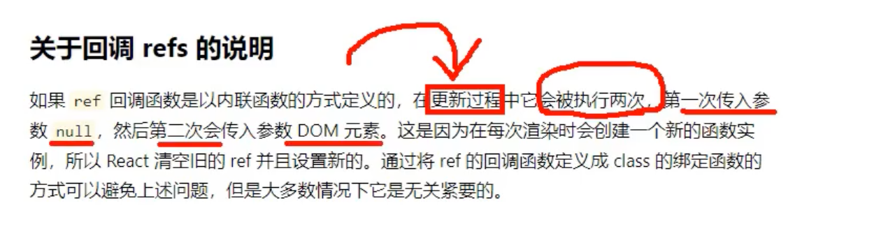
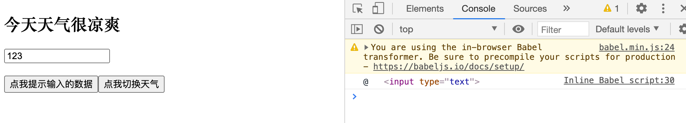
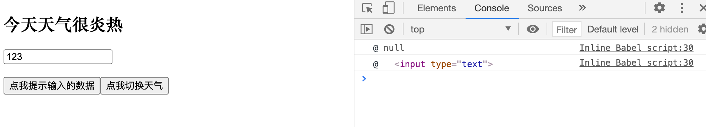

## 回调ref中调用次数的问题



```html
<!DOCTYPE html>
<html lang="en">
<head>
	<meta charset="UTF-8">
	<title>3_回调ref中回调执行次数的问题</title>
</head>
<body>
	<!-- 准备好一个“容器” -->
	<div id="test"></div>
	
	<!-- 引入react核心库 -->
	<script type="text/javascript" src="../js/react.development.js"></script>
	<!-- 引入react-dom，用于支持react操作DOM -->
	<script type="text/javascript" src="../js/react-dom.development.js"></script>
	<!-- 引入babel，用于将jsx转为js -->
	<script type="text/javascript" src="../js/babel.min.js"></script>

	<script type="text/babel">
	
		//创建组件
		class Demo extends React.Component{

			state = {isHot:false}

			showInfo = ()=>{
				const {input1} = this
				alert(input1.value)
			}

			changeWeather = ()=>{
				//获取原来的状态
				const {isHot} = this.state
				//更新状态
				this.setState({isHot:!isHot})
			}

			saveInput = (c)=>{
				this.input1 = c;
				console.log('@',c);
			}

			render(){
				const {isHot} = this.state
				return(
					<div>
						<h2>今天天气很{isHot ? '炎热':'凉爽'}</h2>
						<input ref={(currentNode)=>{this.input1 = currentNode;console.log('@',currentNode);}} type="text"/><br/><br/>
						{/*<input ref={this.saveInput} type="text"/><br/><br/> */}
						<button onClick={this.showInfo}>点我提示输入的数据</button>
						<button onClick={this.changeWeather}>点我切换天气</button>
					</div>
				)
			}
		}
		//渲染组件到页面
		ReactDOM.render(<Demo/>,document.getElementById('test'))
	</script>
</body>
</html>
```


- 注意： 第一次刷新时候：



- 我们清空完，继续看第二次, 点击 `点我切换天气`



- 第一次，传入了null, 第二次传入dom

- 因为每一次更新组件的时候就会被调用两次。 什么是更新组件？ 改变状态， 比如 Hot => Cold, Cold => Hot
- 因为每一次渲染的时候，会创建一个新的函数实例，所以React会清空旧的ref并且设置新的

---

```js
render(){
	const {isHot} = this.state
	return(
		<div>
			<h2>今天天气很{isHot ? '炎热':'凉爽'}</h2>
			<input ref={(currentNode)=>{this.input1 = currentNode;console.log('@',currentNode);}} type="text"/><br/><br/>
			{/*<input ref={this.saveInput} type="text"/><br/><br/> */}
			<button onClick={this.showInfo}>点我提示输入的数据</button>
			<button onClick={this.changeWeather}>点我切换天气</button>
		</div>
	)
}
```


- 一个是 内联函数 ， 一个是内绑定 `<button onClick={this.showInfo}>点我提示输入的数据</button>`
- 以后开发一定是内联函数写得多。 


