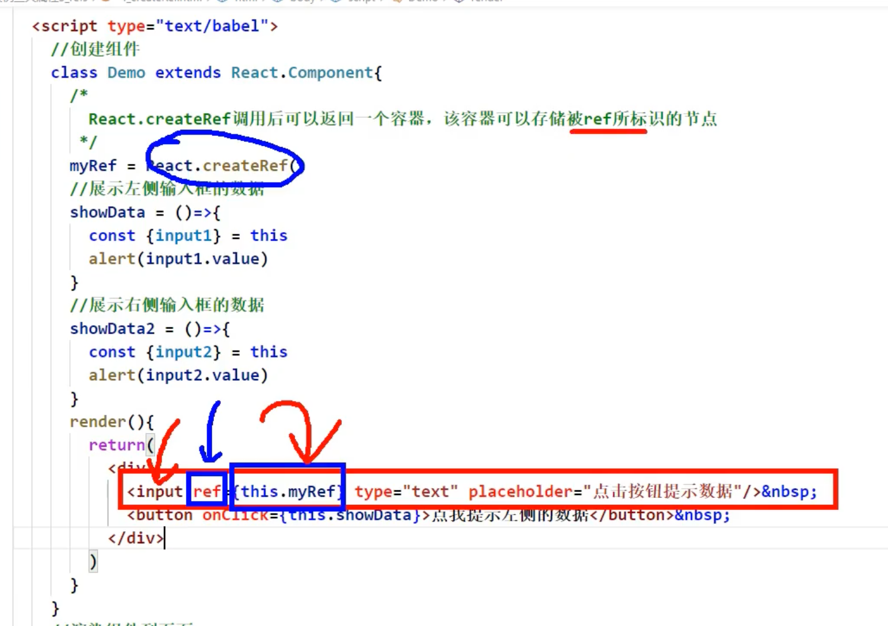
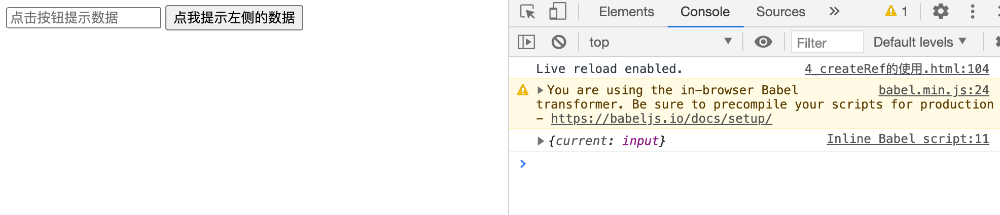
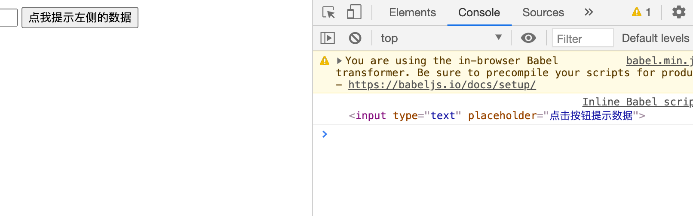
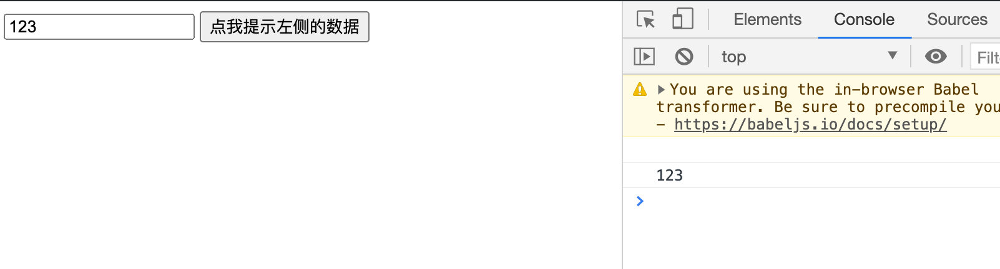
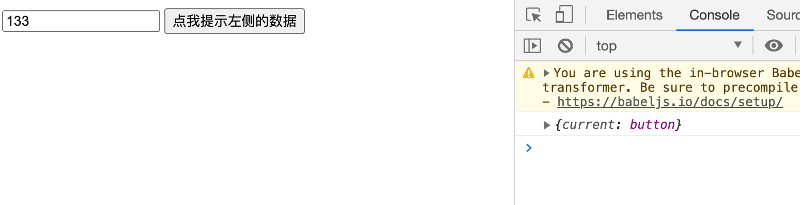
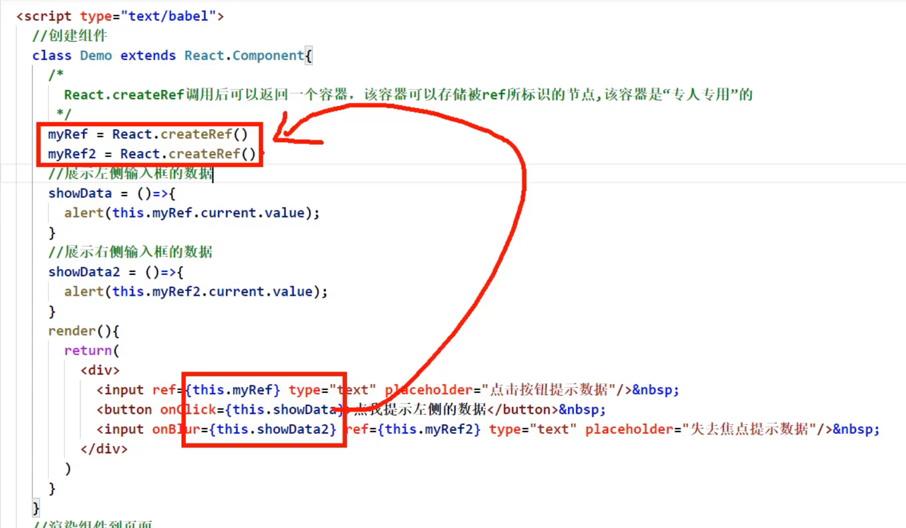

## createRef 的使用



- 如图： `React.createRef()` 是一个容器，可以用来存储 当前 Dom。
  - 因为input标识节点就被存储在了 `React.createRef()` 身上。
  - 这里为什么用this.myRef, 因为 myRef 是放在实例自身上的哦，所以用this 


```html
<!DOCTYPE html>
<html lang="en">
<head>
	<meta charset="UTF-8">
	<title>4_createRef</title>
</head>
<body>
	<!-- 准备好一个“容器” -->
	<div id="test"></div>
	
	<!-- 引入react核心库 -->
	<script type="text/javascript" src="../js/react.development.js"></script>
	<!-- 引入react-dom，用于支持react操作DOM -->
	<script type="text/javascript" src="../js/react-dom.development.js"></script>
	<!-- 引入babel，用于将jsx转为js -->
	<script type="text/javascript" src="../js/babel.min.js"></script>

	<script type="text/babel">
		//创建组件
		class Demo extends React.Component{
			/* 
				React.createRef调用后可以返回一个容器，该容器可以存储被ref所标识的节点,该容器是“专人专用”的
			 */
			myRef = React.createRef()

			//展示左侧输入框的数据
			showData = ()=>{
				console.log(this.myRef)
			}
			//展示右侧输入框的数据
			showData2 = ()=>{
				alert(this.myRef2.current.value);
			}
			render(){
				return(
					<div>
						<input ref={this.myRef} type="text" placeholder="点击按钮提示数据"/>&nbsp;
						<button onClick={this.showData}>点我提示左侧的数据</button>&nbsp;
					</div>
				)
			}
		}
		//渲染组件到页面
		ReactDOM.render(<Demo a="1" b="2"/>,document.getElementById('test'))
	</script>
</body>
</html>
```

- 我们看看 console.log(this.myRef)



- 如果就是`React.createRef()`
  - 所以可以调用 `this.myRef.current`


---


```js
		//创建组件
		class Demo extends React.Component{
			/* 
				React.createRef调用后可以返回一个容器，该容器可以存储被ref所标识的节点,该容器是“专人专用”的
			 */
			myRef = React.createRef()

			//展示左侧输入框的数据
			showData = ()=>{
				console.log(this.myRef.current)
			}
			//展示右侧输入框的数据
			showData2 = ()=>{
				alert(this.myRef2.current.value);
			}
			render(){
				return(
					<div>
						<input ref={this.myRef} type="text" placeholder="点击按钮提示数据"/>&nbsp;
						<button onClick={this.showData}>点我提示左侧的数据</button>&nbsp;
					</div>
				)
			}
		}
		//渲染组件到页面
		ReactDOM.render(<Demo a="1" b="2"/>,document.getElementById('test'))
```



- 输出 input
- 但是我们想要它reference到input的value


```js
		//创建组件
		class Demo extends React.Component{
			/* 
				React.createRef调用后可以返回一个容器，该容器可以存储被ref所标识的节点,该容器是“专人专用”的
			 */
			myRef = React.createRef()

			//展示左侧输入框的数据
			showData = ()=>{
				console.log(this.myRef.current.value)
			}
			//展示右侧输入框的数据
			showData2 = ()=>{
				alert(this.myRef2.current.value);
			}
			render(){
				return(
					<div>
						<input ref={this.myRef} type="text" placeholder="点击按钮提示数据"/>&nbsp;
						<button onClick={this.showData}>点我提示左侧的数据</button>&nbsp;
					</div>
				)
			}
		}
		//渲染组件到页面
		ReactDOM.render(<Demo a="1" b="2"/>,document.getElementById('test'))
```





- 那么问题来了，以后都这样存储不是很好？ 不行，它只能存储一个标识， 它不能存储两个.

- 所以我们假设 createRef 给两个 tag使用


```js
		//创建组件
		class Demo extends React.Component{
			/* 
				React.createRef调用后可以返回一个容器，该容器可以存储被ref所标识的节点,该容器是“专人专用”的
			 */
			myRef = React.createRef()

			//展示左侧输入框的数据
			showData = ()=>{
				// console.log(this.myRef.current.value)
				console.log(this.myRef)
			}
			//展示右侧输入框的数据
			showData2 = ()=>{
				alert(this.myRef2.current.value);
			}
			render(){
				return(
					<div>
						<input ref={this.myRef} type="text" placeholder="点击按钮提示数据"/>&nbsp;
						<button ref={this.myRef} onClick={this.showData}>点我提示左侧的数据</button>&nbsp;
					</div>
				)
			}
		}
		//渲染组件到页面
		ReactDOM.render(<Demo a="1" b="2"/>,document.getElementById('test'))
```




- 由于`React.createRef()`只能存储一个，所以它存储了最新的那个tag， 也就是button


```html
<!DOCTYPE html>
<html lang="en">
<head>
	<meta charset="UTF-8">
	<title>4_createRef</title>
</head>
<body>
	<!-- 准备好一个“容器” -->
	<div id="test"></div>
	
	<!-- 引入react核心库 -->
	<script type="text/javascript" src="../js/react.development.js"></script>
	<!-- 引入react-dom，用于支持react操作DOM -->
	<script type="text/javascript" src="../js/react-dom.development.js"></script>
	<!-- 引入babel，用于将jsx转为js -->
	<script type="text/javascript" src="../js/babel.min.js"></script>

	<script type="text/babel">
		//创建组件
		class Demo extends React.Component{
			/* 
				React.createRef调用后可以返回一个容器，该容器可以存储被ref所标识的节点,该容器是“专人专用”的
			 */
			myRef = React.createRef()
			myRef2 = React.createRef()
			//展示左侧输入框的数据
			showData = ()=>{
				alert(this.myRef.current.value);
			}
			//展示右侧输入框的数据
			showData2 = ()=>{
				alert(this.myRef2.current.value);
			}
			render(){
				return(
					<div>
						<input ref={this.myRef} type="text" placeholder="点击按钮提示数据"/>&nbsp;
						<button onClick={this.showData}>点我提示左侧的数据</button>&nbsp;
						<input onBlur={this.showData2} ref={this.myRef2} type="text" placeholder="失去焦点提示数据"/>&nbsp;
					</div>
				)
			}
		}
		//渲染组件到页面
		ReactDOM.render(<Demo a="1" b="2"/>,document.getElementById('test'))
	</script>
</body>
</html>
```




- 这样做最后，一个麻烦点在于，在下面ref几个tag，在上面就要存储在几个容器上。
- 这种形式是React官方目前最推崇的。


