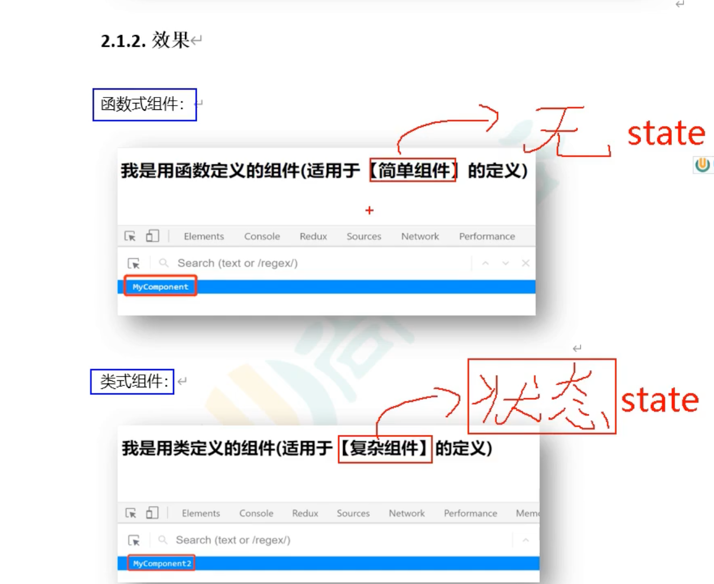
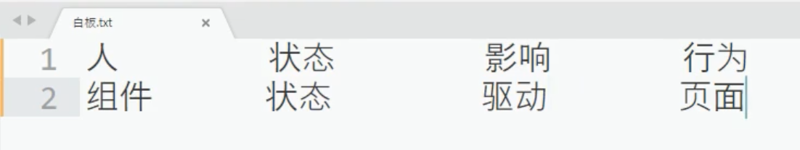
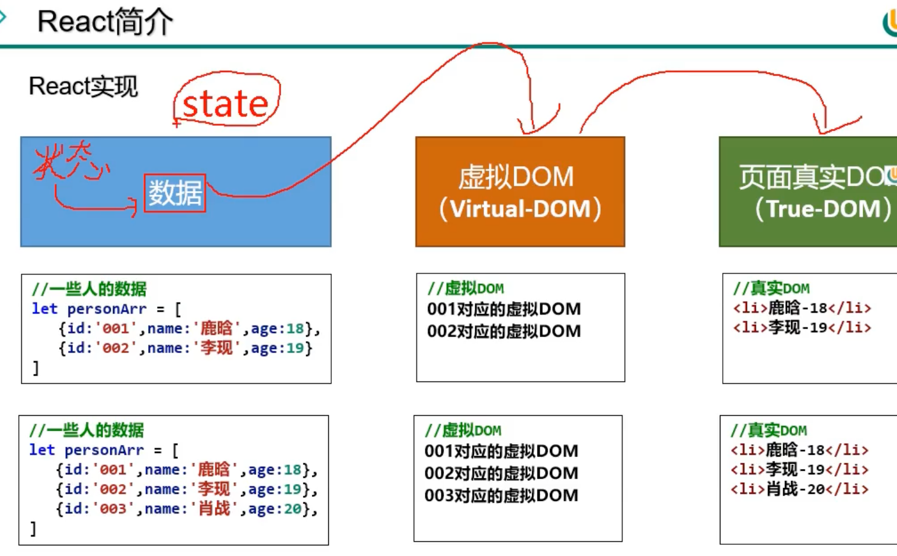
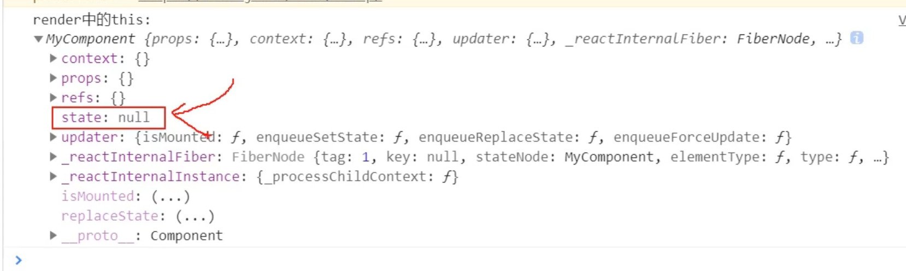
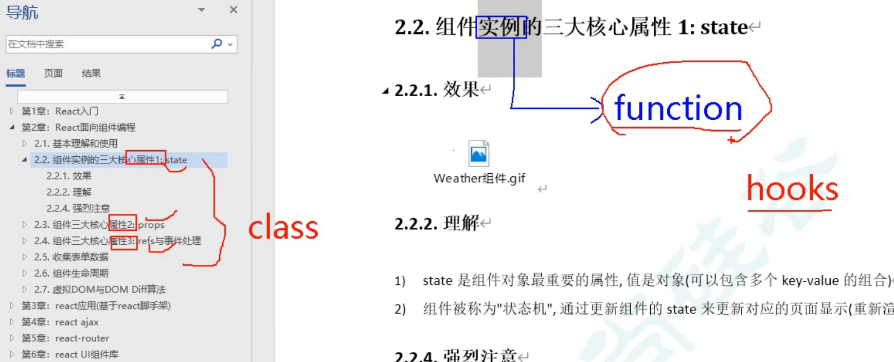

## state 的理解

- 数据放在state里。

- state 就是 react 为我们准备好的状态， 这里的值等着我们给它具体赋值
- state 就是组件实例对象上

---

- **主意**： 
  - 1. 组件实例的三大属性 `state` `props` `refs` 都属于class component 实例
  - 2. function 组件 也可以拥有这三大属性， 但是是在新版 react, `hooks` 里的，之后再解释。

