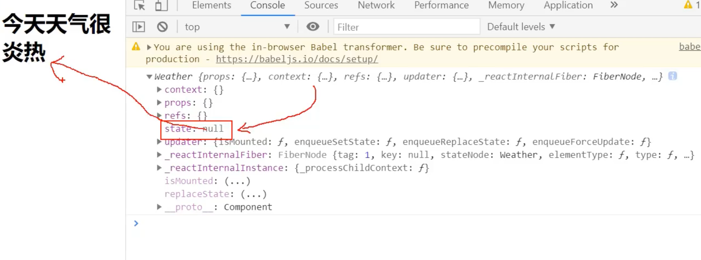

## init state




- state 现在还是 null, 我们现在需要赋值，所以需要 constructor()

```html
    <script type="text/babel">
        //1. create 组件
        class Weather extends React.Component{
            constructor(props){
                super(props)
                this.state = {isHot: true}
            }
            render(){
                console.log(this)
                return <h1>It's very hot today!</h1>
            }
        }

        //2. render 组件到页面
        // ReactDOM.render(class component, Container)
        ReactDOM.render(<Weather/>, document.getElementById('test'))
    </script>
```


```html
    <!-- type="text/babel" 表示现在这里写的是jsx, 不再是js -->
    <script type="text/babel">
        //1. create 组件
        class Weather extends React.Component{
            constructor(props){
                super(props)
                this.state = {isHot: true}
            }
            render(){
                // console.log(this)
                // const {isHot} = this.state;
                // return <h1>It's very {isHot ? 'Hot' : 'Cold'} today!</h1>
                return <h1>It's very {this.state.isHot ? 'Hot' : 'Cold'} today!</h1>
            }
        }

        //2. render 组件到页面
        // ReactDOM.render(class component, Container)
        ReactDOM.render(<Weather/>, document.getElementById('test'))
    </script>
```

- 但是现在这样写还是static的，所以我们要写成dynamic的。


