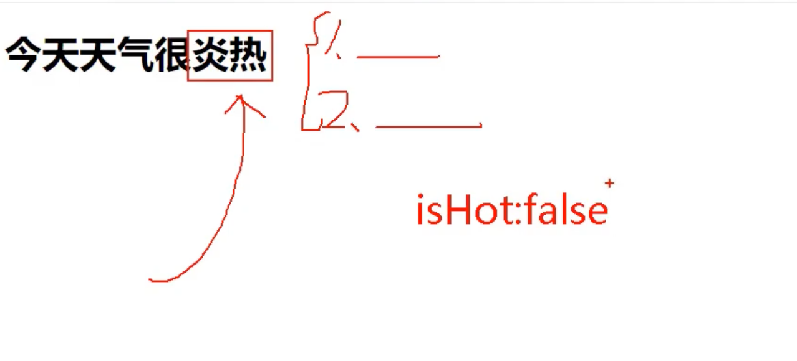
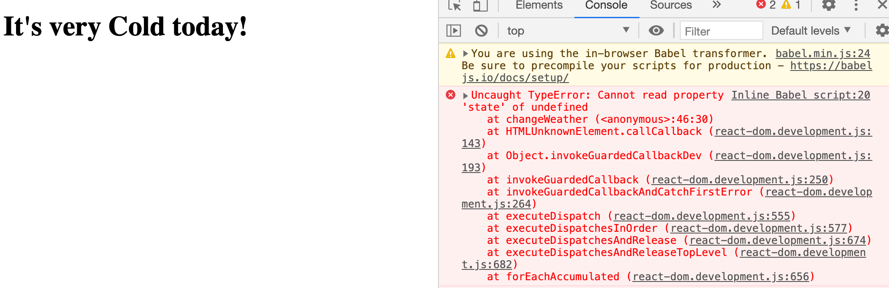

## init state




- state 现在还是 null, 我们现在需要赋值，所以需要 constructor()

```html
    <script type="text/babel">
        //1. create 组件
        class Weather extends React.Component{
            constructor(props){
                super(props)
                this.state = {isHot: true}
            }
            render(){
                console.log(this)
                return <h1>It's very hot today!</h1>
            }
        }

        //2. render 组件到页面
        // ReactDOM.render(class component, Container)
        ReactDOM.render(<Weather/>, document.getElementById('test'))
    </script>
```


```html
    <!-- type="text/babel" 表示现在这里写的是jsx, 不再是js -->
    <script type="text/babel">
        //1. create 组件
        class Weather extends React.Component{
            constructor(props){
                super(props)
                this.state = {isHot: true}
            }
            render(){
                // console.log(this)
                // const {isHot} = this.state;
                // return <h1>It's very {isHot ? 'Hot' : 'Cold'} today!</h1>
                return <h1>It's very {this.state.isHot ? 'Hot' : 'Cold'} today!</h1>
            }
        }

        //2. render 组件到页面
        // ReactDOM.render(class component, Container)
        ReactDOM.render(<Weather/>, document.getElementById('test'))
    </script>
```

- 但是现在这样写还是static的，所以我们要写成dynamic的。

---

## React 中的事件绑定

- 先复习原生事件绑定方式！

```html
<!DOCTYPE html>
<html lang="en">
<head>
    <meta charset="UTF-8">
    <title>原生事件绑定方式</title>
</head>
<body>
    <button id="btn1">Button1</button>
    <button id="btn2">Button2</button>
    <button onclick="demo()">Button3</button>

    <script type="text/javascript">
        const btn1 = document.getElementById('btn1');
        btn1.addEventListener('click', ()=>{
            alert('Button 1 is clicked!');
        })

        const btn2 = document.getElementById('btn2');
        btn2.onclick = () => {
            alert('Button 2 is clicked!')
        }

        function demo(){
            alert('Button 3 is clicked!')
        }
    </script>
</body>
</html>
```


- 三个button 都可以被点击。

---

### 那么react更喜欢用哪一种点击事件呢？


- 我们推荐第三种！

---


- 在react当中, 前两种也能用，但是不推荐，因为操纵dom, `document.getElementById()`


- 所以这样写：


```html
    <!-- type="text/babel" 表示现在这里写的是jsx, 不再是js -->
    <script type="text/babel">
        //1. create 组件
        class Weather extends React.Component{
            constructor(props){
                super(props)
                this.state = {isHot: true}
            }
            render(){
                // console.log(this)
                // const {isHot} = this.state;
                // return <h1>It's very {isHot ? 'Hot' : 'Cold'} today!</h1>
                return <h1 onClick= {demo} >It's very {this.state.isHot ? 'Hot' : 'Cold'} today!</h1>
            }
        }

        //2. render 组件到页面
        // ReactDOM.render(class component, Container)
        ReactDOM.render(<Weather/>, document.getElementById('test'))

        function demo(){
            console.log('title is clicked!')
        }
    </script>
```


---

- 再来复习一下原生，捕获 `this`, 我的 `cs152` final 考试其实也有这题！


- 这里，我们知道 `changeWeather()`, 里的this, 在原生里，是指向了 `window`
- 但是 react, 是指向了 undefine
- 所以我们把`changeWeather()` 放到class 里。

---

### 但是很遗憾，this 依然会丢失!

```html
    <!-- type="text/babel" 表示现在这里写的是jsx, 不再是js -->
    <script type="text/babel">
        //1. create 组件
        class Weather extends React.Component{
            constructor(props){
                super(props)
                this.state = {isHot: true}
            }
            render(){
                // console.log(this)
                const {isHot} = this.state;
                // return <h1>It's very {isHot ? 'Hot' : 'Cold'} today!</h1>
                return <h1 onClick= {this.changeWeather} >It's very {isHot ? 'Hot' : 'Cold'} today!</h1>
            }
            
            //changeWeather 方法放在了哪里？ -- Weather的原型对象上，供实例使用
            //通过Weather实例调用changeWeather时，changeWeather中的this就是Weather实例
            changeWeather(){
                console.log(this.state.isHot)
            }
        }

        //2. render 组件到页面
        // ReactDOM.render(class component, Container)
        ReactDOM.render(<Weather/>, document.getElementById('test'))
    </script>
```


---

## 我们继续复习class中的方法this指向


```html
<!DOCTYPE html>
<html lang="en">
<head>
    <meta charset="UTF-8">
    <title>1_函数式编程</title>
</head>
<body>
    <!-- 准备好一个容器 -->
    <div id="test"></div>

    <!-- import core lirbary -->
    <script type="text/javascript" src="../js/react.development.js"></script>

    <!-- import react-dom, is used to support react to operation on DOM -->
    <script type="text/javascript" src="../js/react-dom.development.js"></script>

    <!-- import babel, jsx => js -->
    <script type="text/javascript" src="../js/babel.min.js"></script>

    <!-- type="text/babel" 表示现在这里写的是jsx, 不再是js -->
    <script type="text/babel">
        //1. create 组件
        class Weather extends React.Component{
            constructor(props){
                super(props)
                this.state = {isHot: true}
            }
            render(){
                // console.log(this)
                const {isHot} = this.state;
                // return <h1>It's very {isHot ? 'Hot' : 'Cold'} today!</h1>
                return <h1 onClick= {this.changeWeather} >It's very {isHot ? 'Hot' : 'Cold'} today!</h1>
            }
            
            changeWeather(){
                //changeWeather 方法放在了哪里？ -- Weather的原型对象上，供实例使用
                //由于changeWeather是作为onClick的callback,所以不是通过实例调用，是直接调用
                //类中的方法默认开启了local `use strict`, 所以changeWeather中的this为undefined                
                console.log(this.state.isHot)
                console.log(this)
            }
        }

        //2. render 组件到页面
        // ReactDOM.render(class component, Container)
        ReactDOM.render(<Weather/>, document.getElementById('test'))

        // const w = new Weather();
        // w.changeWeather();
    </script>
    
</body>
</html>
```

- 主意这样写，依旧是undefine



- 所以加上这句话： `this.changeWeather = this.changeWeather.bind(this);`


```html
    <!-- type="text/babel" 表示现在这里写的是jsx, 不再是js -->
    <script type="text/babel">
        //1. create 组件
        class Weather extends React.Component{
            constructor(props){
                super(props)
                this.state = {isHot: false}
                this.changeWeather = this.changeWeather.bind(this);
            }
            render(){
                // console.log(this)
                const {isHot} = this.state;
                // return <h1>It's very {isHot ? 'Hot' : 'Cold'} today!</h1>
                return <h1 onClick= {this.changeWeather} >It's very {isHot ? 'Hot' : 'Cold'} today!</h1>
            }
            
            changeWeather(){
                //changeWeather 方法放在了哪里？ -- Weather的原型对象上，供实例使用
                //由于changeWeather是作为onClick的callback,所以不是通过实例调用，是直接调用
                //类中的方法默认开启了local `use strict`, 所以changeWeather中的this为undefined                
                console.log(this.state.isHot)
                console.log(this)
            }
        }

        //2. render 组件到页面
        // ReactDOM.render(class component, Container)
        ReactDOM.render(<Weather/>, document.getElementById('test'))

        // const w = new Weather();
        // w.changeWeather();
    </script>
```


