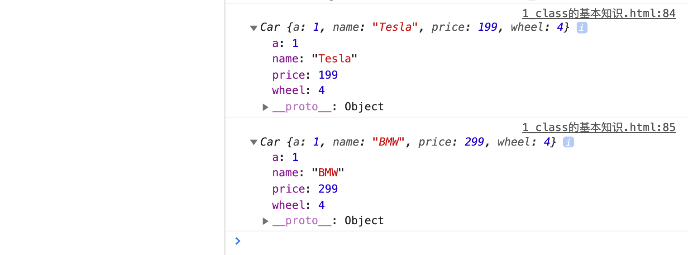
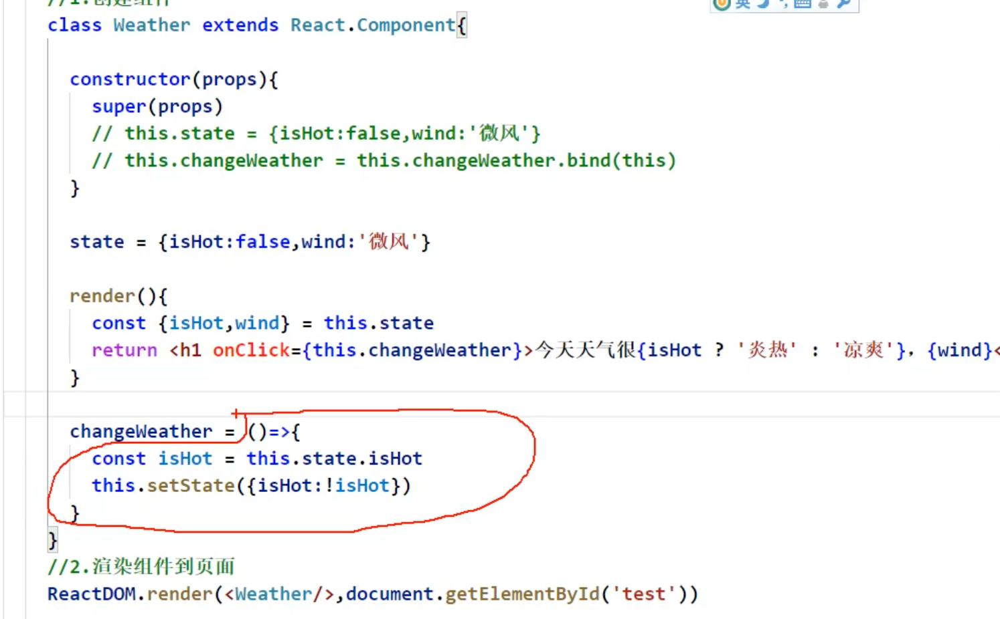
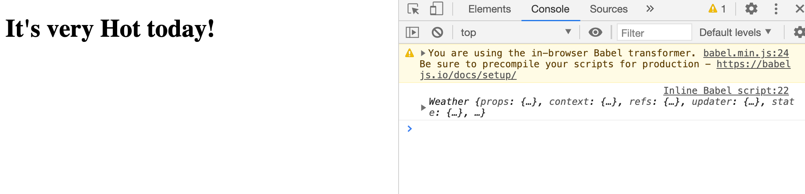

## state 的简写

- 复习一下 class:

```js
        class Car {
            constructor(name, price){
                this.name = name;
                this.price = price;
                this.wheel = 4;
            }

            //类中可以直接写赋值语句，如下代码的含义是：给car的实例对象添加一个属性，名为a, 值为1
            a = 1;
        }

        const c1 = new Car('Tesla', 199);
        const c2 = new Car('BMW', 299);
        console.log(c1)
        console.log(c2)
```



---

- 所以接下来的箭头函数，就会是在类体里的 一个 `a = 1` 的赋值！



- **重点**： 箭头函数本身没有this指向，它的this纯粹就是为了指向类的实例

```html
    <!-- type="text/babel" 表示现在这里写的是jsx, 不再是js -->
    <script type="text/babel">
        //1. create 组件
        class Weather extends React.Component{
            //初始化状态
            state = {isHot: false};

            render(){
                const {isHot} = this.state;
                return <h1 onClick= {this.changeWeather} >It's very {isHot ? 'Hot' : 'Cold'} today!</h1>
            }
            
            //自定义方法 ———— 要用赋值语句的形式 + 箭头函数
            changeWeather = () => {
                const isHot = this.state.isHot;
                this.setState({isHot: !isHot})
                console.log(this);
            }
        }

        //2. render 组件到页面
        // ReactDOM.render(class component, Container)
        ReactDOM.render(<Weather/>, document.getElementById('test'))
    </script>
```



- 可以看到箭头函数的this 指向了 实例


