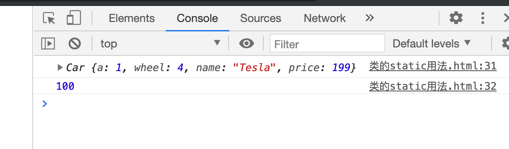

## static 关键字

```html
<!DOCTYPE html>
<html lang="en">
<head>
    <meta charset="UTF-8">
    <title>class的 static 用法</title>
</head>
<body>
    <script type="text/javascript">

        /*
        总结：
            1. 类中的构造器不是必须写的，要对实例进行一些初始化的操作，如添加指定属性时，才写。
            2. 如果A类继承了B类，且A类中写了构造器，那么A类构造器中的super是必须要调用的
            3. 类中所定义的方法，都是放在了类的原型对象上, 供实例去使用
        */

        class Car {
            constructor(name, price){
                this.name = name;
                this.price = price;
                this.wheel = 4;
            }

            //类中可以直接写赋值语句，如下代码的含义是：给car的实例对象添加一个属性，名为a, 值为1
            a = 1;
            wheel = 4;
            demo = 100;
        }
        // Car.demo = 100;
        const c1 = new Car('Tesla', 199);
        console.log(c1)
        console.log(Car.demo); //输出 undefined
    </script>
</body>
</html>
```

- 必须给Car new 一个实例，才能输出 100:

```js
        class Car {
            constructor(name, price){
                this.name = name;
                this.price = price;
                this.wheel = 4;
            }

            //类中可以直接写赋值语句，如下代码的含义是：给car的实例对象添加一个属性，名为a, 值为1
            a = 1;
            wheel = 4;
            demo = 100;
        }
        // Car.demo = 100;
        const C1 = new Car('Tesla', 199);
        console.log(C1)
        console.log(C1.demo);
```


- 如果直接调用，那必须加上static 关键字


```js
        class Car {
            constructor(name, price){
                this.name = name;
                this.price = price;
                this.wheel = 4;
            }

            //类中可以直接写赋值语句，如下代码的含义是：给car的实例对象添加一个属性，名为a, 值为1
            a = 1;
            wheel = 4;
            static demo = 100;
        }
        // Car.demo = 100;
        const C1 = new Car('Tesla', 199);
        console.log(C1)
        console.log(Car.demo);
```




