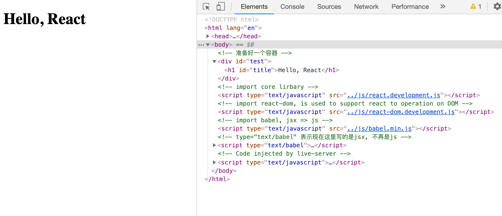
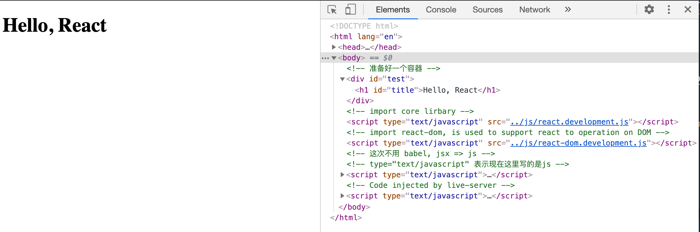
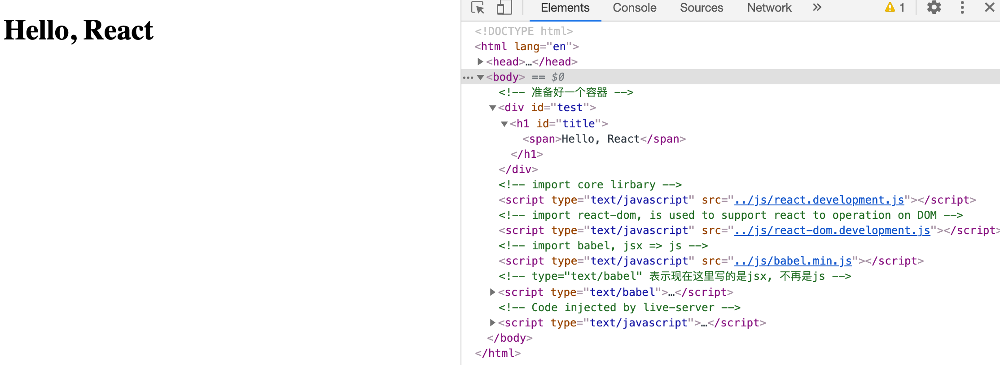
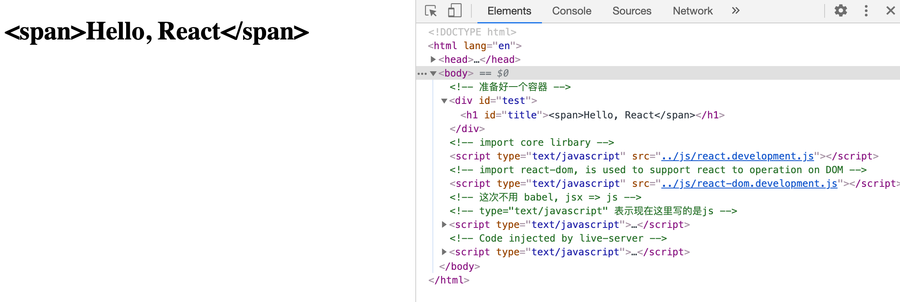
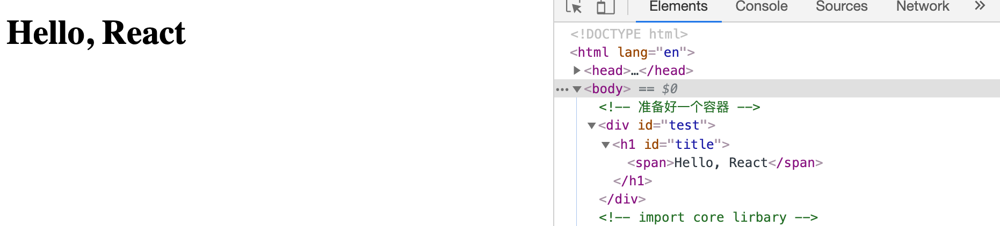
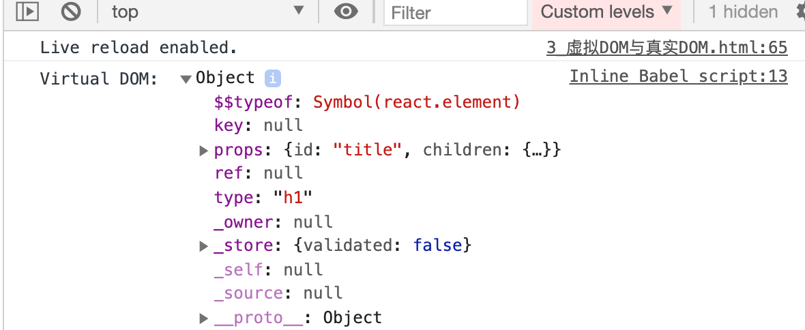
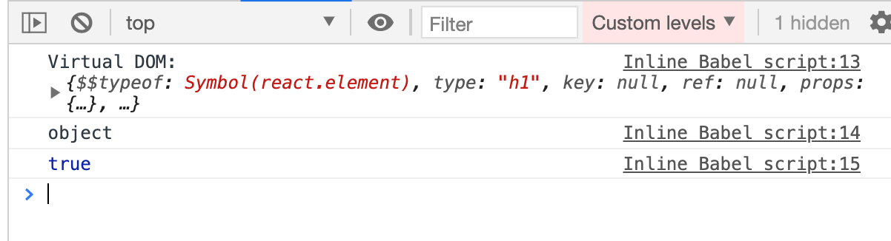
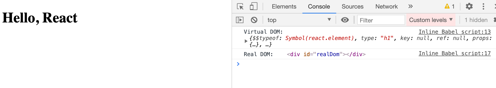
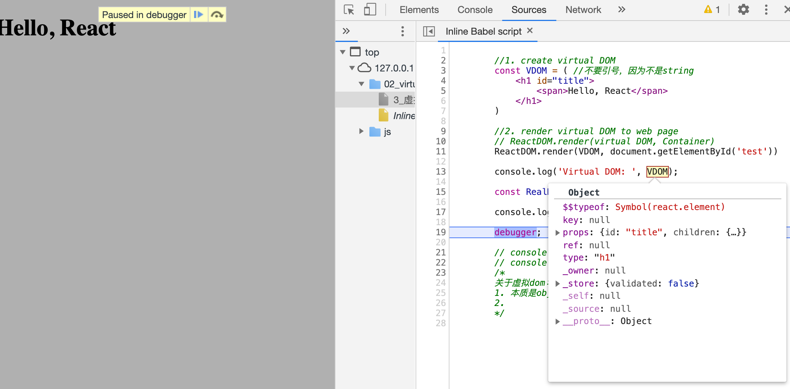
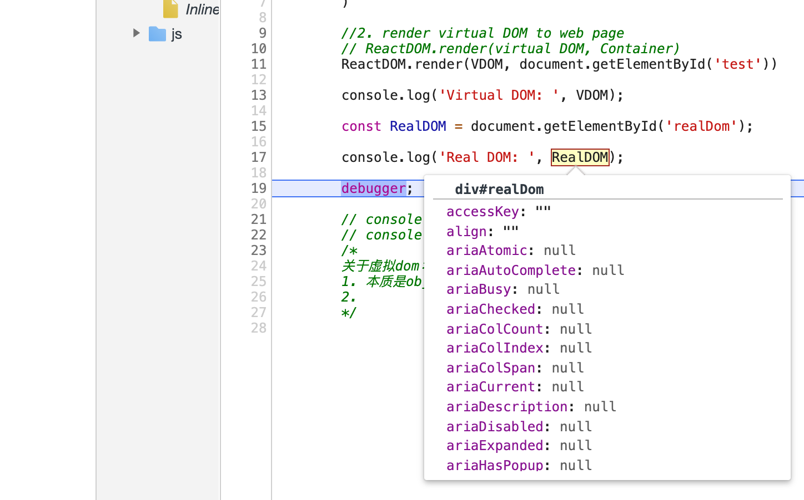

## Virtual DOM 的两种创建方式


### 1. 使用jsx 创建 virtual DOM

```html
<!DOCTYPE html>
<html lang="en">
<head>
    <meta charset="UTF-8">
    <meta name="viewport" content="width=device-width, initial-scale=1.0">
    <title>1. use jsx to create virtual DOM</title>
</head>
<body>
    <!-- 准备好一个容器 -->
    <div id="test"></div>

    <!-- import core lirbary -->
    <script type="text/javascript" src="../js/react.development.js"></script>

    <!-- import react-dom, is used to support react to operation on DOM -->
    <script type="text/javascript" src="../js/react-dom.development.js"></script>

    <!-- import babel, jsx => js -->
    <script type="text/javascript" src="../js/babel.min.js"></script>

    <!-- type="text/babel" 表示现在这里写的是jsx, 不再是js -->
    <script type="text/babel">
        //1. create virtual DOM
        const VDOM = <h1 id="title">Hello, React</h1> //不要引号，因为不是string

        //2. render virtual DOM to web page
        // ReactDOM.render(virtual DOM, Container)
        ReactDOM.render(VDOM, document.getElementById('test'))
    </script>
    
</body>
</html>
```



---

### 2. 使用js 创建 virtual DOM

```html
<!DOCTYPE html>
<html lang="en">
<head>
    <meta charset="UTF-8">
    <meta name="viewport" content="width=device-width, initial-scale=1.0">
    <title>2 use js to create virtual DOM</title>
</head>
<body>
    <!-- 准备好一个容器 -->
    <div id="test"></div>

    <!-- import core lirbary -->
    <script type="text/javascript" src="../js/react.development.js"></script>

    <!-- import react-dom, is used to support react to operation on DOM -->
    <script type="text/javascript" src="../js/react-dom.development.js"></script>

    <!-- 这次不用 babel, jsx => js -->


    <!-- type="text/javascript" 表示现在这里写的是js -->
    <script type="text/javascript">
        //1. create virtual DOM
        //React.creatElement(标签名，标签属性，标签内容)
        const VDOM = React.createElement('h1', {id:'title'}, 'Hello, React');

        //2. render virtual DOM to web page
        // ReactDOM.render(virtual DOM, Container)
        ReactDOM.render(VDOM, document.getElementById('test'))
    </script>
    
</body>
</html>
```



---

## 以上两种方式都可以实现创建virtual DOM, 那么为什么用React?

1. 我们回头来看 jsx, 我们让它 div 里面增加一个 `<span>`

```html
<!DOCTYPE html>
<html lang="en">
<head>
    <meta charset="UTF-8">
    <meta name="viewport" content="width=device-width, initial-scale=1.0">
    <title>1. use jsx to create virtual DOM</title>
</head>
<body>
    <!-- 准备好一个容器 -->
    <div id="test"></div>

    <!-- import core lirbary -->
    <script type="text/javascript" src="../js/react.development.js"></script>

    <!-- import react-dom, is used to support react to operation on DOM -->
    <script type="text/javascript" src="../js/react-dom.development.js"></script>

    <!-- import babel, jsx => js -->
    <script type="text/javascript" src="../js/babel.min.js"></script>

    <!-- type="text/babel" 表示现在这里写的是jsx, 不再是js -->
    <script type="text/babel">
        //1. create virtual DOM
        const VDOM = <h1 id="title"><span>Hello, React</span></h1> //不要引号，因为不是string

        //2. render virtual DOM to web page
        // ReactDOM.render(virtual DOM, Container)
        ReactDOM.render(VDOM, document.getElementById('test'))
    </script>
    
</body>
</html>
```




### 现在我们拿JS 写一遍：


```html
<!DOCTYPE html>
<html lang="en">
<head>
    <meta charset="UTF-8">
    <meta name="viewport" content="width=device-width, initial-scale=1.0">
    <title>2 use js to create virtual DOM</title>
</head>
<body>
    <!-- 准备好一个容器 -->
    <div id="test"></div>

    <!-- import core lirbary -->
    <script type="text/javascript" src="../js/react.development.js"></script>

    <!-- import react-dom, is used to support react to operation on DOM -->
    <script type="text/javascript" src="../js/react-dom.development.js"></script>

    <!-- 这次不用 babel, jsx => js -->


    <!-- type="text/javascript" 表示现在这里写的是js -->
    <script type="text/javascript">
        //1. create virtual DOM
        //React.creatElement(标签名，标签属性，标签内容)
        const VDOM = React.createElement('h1', {id:'title'}, '<span>Hello, React</span>');

        //2. render virtual DOM to web page
        // ReactDOM.render(virtual DOM, Container)
        ReactDOM.render(VDOM, document.getElementById('test'))
    </script>
    
</body>
</html>
```



- 因为 `React.creatElement(标签名，标签属性，标签内容)`

---

- 😓， 那我们怎么写？


```html
    <!-- type="text/javascript" 表示现在这里写的是js -->
    <script type="text/javascript">
        //1. create virtual DOM
        //React.creatElement(标签名，标签属性，标签内容)
        const VDOM = React.createElement('h1', {id:'title'}, React.createElement('span', {}, 'Hello, React'));

        //2. render virtual DOM to web page
        // ReactDOM.render(virtual DOM, Container)
        ReactDOM.render(VDOM, document.getElementById('test'))
    </script>
```




### 但是我们可以这样写 jsx 的dom结构：

```html
    <!-- import babel, jsx => js -->
    <script type="text/javascript" src="../js/babel.min.js"></script>

    <!-- type="text/babel" 表示现在这里写的是jsx, 不再是js -->
    <script type="text/babel">
        //1. create virtual DOM
        const VDOM = ( //不要引号，因为不是string
            <h1 id="title">
                <span>Hello, React</span>
            </h1> 
        )

        //2. render virtual DOM to web page
        // ReactDOM.render(virtual DOM, Container)
        ReactDOM.render(VDOM, document.getElementById('test'))
    </script>
```

- 但是问题来了，浏览器不认识这种写法，所以我们import 了 babel
- 它最终被翻译成了：

```html
    <!-- type="text/javascript" 表示现在这里写的是js -->
    <script type="text/javascript">
        //1. create virtual DOM
        //React.creatElement(标签名，标签属性，标签内容)
        const VDOM = React.createElement('h1', {id:'title'}, React.createElement('span', {}, 'Hello, React'));

        //2. render virtual DOM to web page
        // ReactDOM.render(virtual DOM, Container)
        ReactDOM.render(VDOM, document.getElementById('test'))
    </script>
```

---

## 虚拟DOM 与 真实DOM

1. 虚拟dom 到底是啥？

```html
    <!-- type="text/babel" 表示现在这里写的是jsx, 不再是js -->
    <script type="text/babel">
        //1. create virtual DOM
        const VDOM = ( //不要引号，因为不是string
            <h1 id="title">
                <span>Hello, React</span>
            </h1> 
        )

        //2. render virtual DOM to web page
        // ReactDOM.render(virtual DOM, Container)
        ReactDOM.render(VDOM, document.getElementById('test'))

        console.log('Virtual DOM: ', VDOM)
    </script>
```



- 所以虚拟dom就是一个一般object.

```html
    <!-- type="text/babel" 表示现在这里写的是jsx, 不再是js -->
    <script type="text/babel">
        //1. create virtual DOM
        const VDOM = ( //不要引号，因为不是string
            <h1 id="title">
                <span>Hello, React</span>
            </h1> 
        )

        //2. render virtual DOM to web page
        // ReactDOM.render(virtual DOM, Container)
        ReactDOM.render(VDOM, document.getElementById('test'))

        console.log('Virtual DOM: ', VDOM);
        console.log(typeof VDOM);
        console.log(VDOM instanceof Object);
    </script>
```




- 现在来看一个真实dom, 

```html
<!DOCTYPE html>
<html lang="en">
<head>
    <meta charset="UTF-8">
    <meta name="viewport" content="width=device-width, initial-scale=1.0">
    <title>3_虚拟DOM与真实DOM</title>
</head>
<body>
    <!-- 准备好一个容器 -->
    <div id="test"></div>
    <div id="realDom"></div>

    <!-- import core lirbary -->
    <script type="text/javascript" src="../js/react.development.js"></script>

    <!-- import react-dom, is used to support react to operation on DOM -->
    <script type="text/javascript" src="../js/react-dom.development.js"></script>

    <!-- import babel, jsx => js -->
    <script type="text/javascript" src="../js/babel.min.js"></script>

    <!-- type="text/babel" 表示现在这里写的是jsx, 不再是js -->
    <script type="text/babel">
        //1. create virtual DOM
        const VDOM = ( //不要引号，因为不是string
            <h1 id="title">
                <span>Hello, React</span>
            </h1> 
        )

        //2. render virtual DOM to web page
        // ReactDOM.render(virtual DOM, Container)
        ReactDOM.render(VDOM, document.getElementById('test'))

        console.log('Virtual DOM: ', VDOM);

        const RealDOM = document.getElementById('realDom');

        console.log('Real DOM: ', RealDOM);

        // console.log(typeof VDOM);
        // console.log(VDOM instanceof Object);
        /*
        关于虚拟dom：
        1. 本质是object的类型对象（一般对象）
        2. 
        */
    </script>
    
</body>
</html>
```



- 但是，真实DOM 输出的是标签，它的属性我们没法看，所以借助 **break point**, named `debugger`



- 我们可以看到虚拟dom只有几个属性。



- 我们可以看到真实dom非常多的属性


