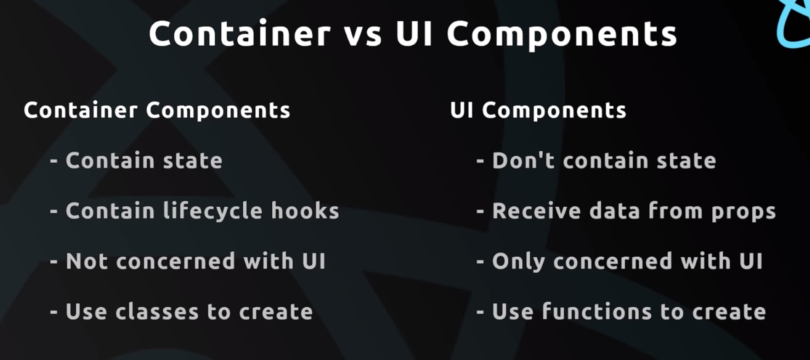

# 2. Redux Advanced

### `UI 组件与容器组件的拆分`

- ui 组件负责渲染

- contanier组件 负责逻辑

- in `store` folder, we create a `TodoList.js`

- we move the content of TodoList's render() to TodoListUI

```js
//TodoListUI.js
import React, { Component } from 'react';
import { Input, Button, List } from 'antd';
class TodoListUI extends Component {
    render() {
        return (
            <div style={{ marginTop: '10px', marginLetf: '10px' }}>
                <div>
                    <Input
                        value={this.props.inputValue}
                        placeholder='todo info'
                        style={{ width: 300, marginRight: 10 }}
                        onChange={this.props.handleInputChange}
                    />
                    <Button type="primary" onClick={this.props.handleBtnClick}>提交</Button>
                </div>
                <List
                    style={{ marginTop: 10, width: 300 }}
                    bordered
                    dataSource={this.props.list}
                    renderItem={(item, index) => (
                        <List.Item onClick={(index) => { this.props.handleItemDelete(index) }}>{item}</List.Item>
                    )}
                />
            </div>
        )
    }
}
export default TodoListUI;
```

`TodoList.js`

```js
//代码优化
import React, { Component } from 'react';
import 'antd/dist/antd.css';
// import { Input, Button, List } from 'antd';
import store from './store';
import { getInputChangeAction, getAddItemAction, getDeleteItemAction } from './store/actionCreators';
import TodoListUI from './TodoListUI'
class TodoList extends Component {
    constructor(props) {
        super(props);
        this.state = store.getState();
        // this.handleInputChange = this.handleInputChange.bind(this);
        // this.handleStoreChange = this.handleStoreChange.bind(this);
        // this.handleBtnClick = this.handleBtnClick.bind(this);
        store.subscribe(this.handleStoreChange);
    }
    handleStoreChange = () => {
        this.setState(store.getState());
    }
    handleInputChange = (e) => {
        const action = getInputChangeAction(e.target.value);
        store.dispatch(action);
    }
    handleBtnClick = () => {
        const action = getAddItemAction();
        store.dispatch(action);
    }
    handleItemDelete = (index) => {
        const action = getDeleteItemAction(index);
        store.dispatch(action);
    }
    render() {
        return (
            <TodoListUI
                inputValue={this.state.inputValue}
                list={this.state.list}
                handleInputChange={this.handleInputChange}
                handleBtnClick={this.handleBtnClick}
                handleItemDelete={this.handleItemDelete}
            />
        )
    }
}
export default TodoList;
```

- 最后的运行效果还是一样


### `无状态组件`

- 就是一个函数，性能比较高

```js
import React, { Component } from 'react';
import { Input, Button, List } from 'antd';
//这是一个无状态组件
const TodoListUI = (props) => {
    return (
        <div style={{ marginTop: '10px', marginLetf: '10px' }}>
            <div>
                <Input
                    value={props.inputValue}
                    placeholder='todo info'
                    style={{ width: 300, marginRight: 10 }}
                    onChange={props.handleInputChange}
                />
                <Button type="primary" onClick={props.handleBtnClick}>提交</Button>
            </div>
            <List
                style={{ marginTop: 10, width: 300 }}
                bordered
                dataSource={props.list}
                renderItem={(item, index) => (
                    <List.Item onClick={(index) => { props.handleItemDelete(index) }}>{item}</List.Item>
                )}
            />
        </div>
    )
}
export default TodoListUI;
```

- 原先的 TodoListUI 是一个class, 它有生命周期函数，还要执行 render() function




### `Redux 中发送异步请求获取数据`

- in TodoList

`import axios from 'axios';`


### `Redux 中发送异步请求获取数据`


### `使用Redux-thunk中间件实现ajax数据请求`


### `Redux的中间件`


### `Redux-saga 中间件的使用`